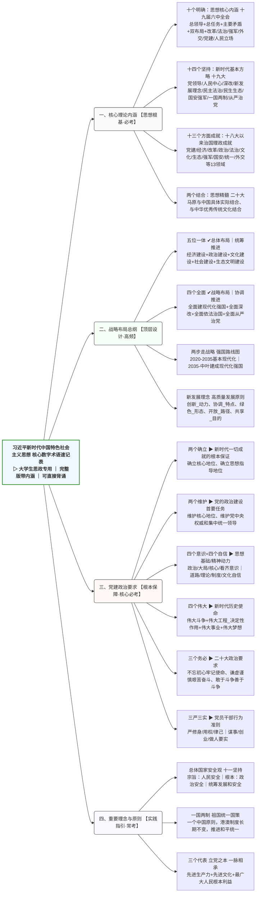
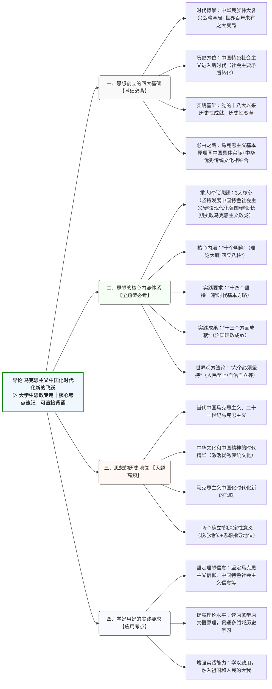
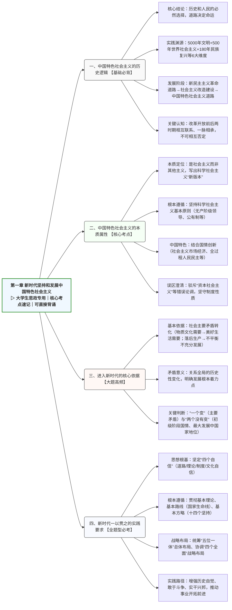
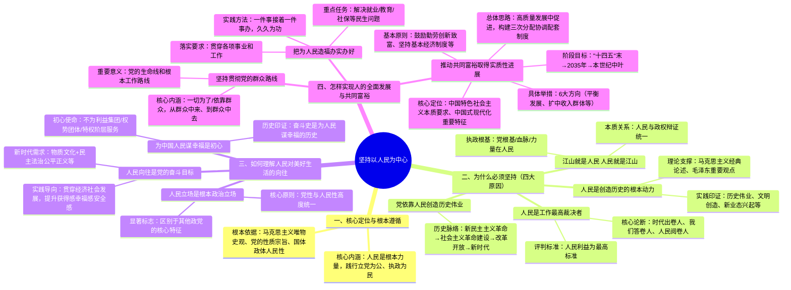
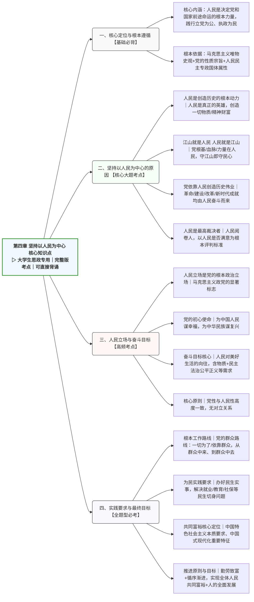
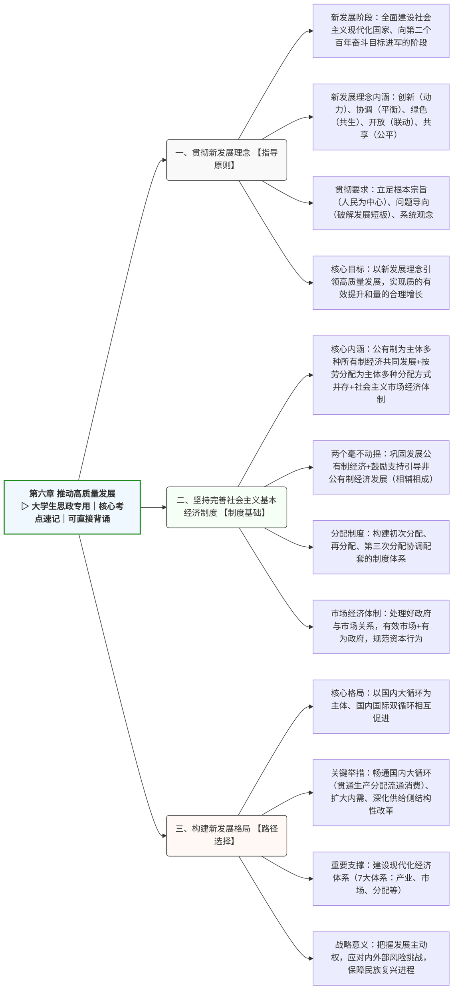

# 专业术语

- **一、核心理论内涵【思想根基·必考】**
  - 十个明确（十九届六中全会）
    - ① 总领导：中国共产党是最高政治领导力量，坚持党中央集中统一领导
    - ② 总任务：实现社会主义现代化和中华民族伟大复兴，分两步走建成强国
    - ③ 主要矛盾：人民日益增长的美好生活需要和不平衡不充分的发展之间的矛盾
    - ④ 总体布局：统筹推进“五位一体”，战略布局：协调推进“四个全面”
    - ⑤ 改革总目标：完善和发展中国特色社会主义制度、推进国家治理体系和治理能力现代化
    - ⑥ 法治总目标：建设中国特色社会主义法治体系、建设社会主义法治国家
    - ⑦ 强军目标：建设一支听党指挥、能打胜仗、作风优良的人民军队
    - ⑧ 外交：推动构建新型国际关系，推动构建人类命运共同体
    - ⑨ 党建：坚持新时代党的建设总要求，以伟大自我革命引领伟大社会革命
    - ⑩ 根本立场：坚持以人民为中心，发展为了人民、发展依靠人民
  - 十四个坚持（新时代基本方略·十九大）
    - 坚持党对一切工作的领导
    - 坚持以人民为中心
    - 坚持全面深化改革
    - 坚持新发展理念
    - 坚持人民当家作主
    - 坚持全面依法治国
    - 坚持社会主义核心价值体系
    - 坚持在发展中保障和改善民生
    - 坚持人与自然和谐共生
    - 坚持总体国家安全观
    - 坚持党对人民军队的绝对领导
    - 坚持“一国两制”和推进祖国统一
    - 坚持推动构建人类命运共同体
    - 坚持全面从严治党
  - 十三个方面成就（十八大以来历史性成就·十九届六中全会）
    - 坚持党的全面领导、全面从严治党、经济建设、全面深化改革开放
    - 政治建设、全面依法治国、文化建设、社会建设、生态文明建设
    - 国防和军队建设、维护国家安全、坚持“一国两制”和祖国统一、外交工作
  - 两个结合（思想精髓·二十大）
    - ✅ 马克思主义基本原理 ↔ 中国具体实际相结合（立足国情、实事求是）
    - ✅ 马克思主义基本原理 ↔ 中华优秀传统文化相结合（守正创新、赓续文脉）
- **二、战略布局与发展总纲【顶层设计·高频】**
  - 五位一体「总体布局」（统筹推进）
    - 经济建设：高质量发展，构建新发展格局
    - 政治建设：全过程人民民主，坚持党的领导、人民当家作主、依法治国有机统一
    - 文化建设：坚定文化自信，弘扬社会主义核心价值观，建设文化强国
    - 社会建设：以人民为中心，保障民生、促进公平，推进共同富裕
    - 生态文明建设：绿水青山就是金山银山，推动人与自然和谐共生的现代化
  - 四个全面「战略布局」（二十大最新·协调推进）
    - ✅ 全面建设社会主义现代化国家【总目标】
    - ✅ 全面深化改革【根本动力】
    - ✅ 全面依法治国【法治保障】
    - ✅ 全面从严治党【根本保证】
  - 两步走「强国战略」（二十大）
    - 第一阶段（2020-2035年）：基本实现社会主义现代化
    - 第二阶段（2035-本世纪中叶）：建成富强民主文明和谐美丽的社会主义现代化强国
  - 五大新发展理念（高质量发展指导原则）
    - 创新：发展第一动力
    - 协调：发展内生特点
    - 绿色：发展普遍形态
    - 开放：发展必由之路
    - 共享：发展根本目的
- **三、政治建设与党建要求【根本保障·核心】**
  - 两个确立「根本保证」
    - ✅ 确立习近平同志党中央的核心、全党的核心地位
    - ✅ 确立习近平新时代中国特色社会主义思想的指导地位
  - 两个维护「政治建设首要任务」
    - ✅ 坚决维护习近平总书记党中央的核心、全党的核心地位
    - ✅ 坚决维护党中央权威和集中统一领导
  - 四个意识「思想基础」
    - 政治意识
    - 大局意识
    - 核心意识
    - 看齐意识
  - 四个自信「精神动力」
    - 道路自信
    - 理论自信
    - 制度自信
    - 文化自信
  - 四个伟大「时代使命」
    - 伟大斗争（攻坚克难）
    - 伟大工程（党的建设·决定性作用）
    - 伟大事业（中国特色社会主义）
    - 伟大梦想（民族复兴）
  - 三个务必「二十大政治要求」
    - ✅ 务必不忘初心、牢记使命
    - ✅ 务必谦虚谨慎、艰苦奋斗
    - ✅ 务必敢于斗争、善于斗争
- **四、重要理念与重大原则【实践指引·常考】**
  - 总体国家安全观「十一坚持」
    - 宗旨：人民安全
    - 根本：政治安全
    - 基础：经济安全
    - 统筹：发展和安全，覆盖政治、国土、军事、经济、文化、社会、科技、网络、生态、资源、核安全
  - 一国两制「祖国统一」
    - 核心：一个中国原则，国家主体实行社会主义制度
    - 要求：香港、澳门保持原有资本主义制度长期不变，推进祖国和平统一
  - 三个代表「一脉相承」
    - 代表中国先进生产力的发展要求
    - 代表中国先进文化的前进方向
    - 代表中国最广大人民的根本利益

---

# 第零章：导论

## 一、思想创立的基础（四大维度）

### （一）时代背景

“两个大局” 同步交织、相互激荡，即中华民族伟大复兴战略全局与世界百年未有之大变局。世界变局加速演进，国际格局、治理体系深刻调整，经济重心 “自西向东” 位移；民族复兴进入关键时期，二者相互成就、带来战略机遇与风险挑战。

### （二）历史方位

中国特色社会主义进入新时代，社会主要矛盾转化为人民日益增长的美好生活需要和不平衡不充分的发展之间的矛盾。新时代是承前启后、决胜全面小康、推进共同富裕、实现民族复兴、为人类作更大贡献的时代。

### （三）实践基础

党的十八大以来，党和国家事业取得历史性成就、发生历史性变革。涵盖全面加强党的领导、实现千年小康梦、贯彻新发展理念、全面深化改革、生态文明建设、强军兴军等多个领域，为思想创立提供坚实实践支撑。

### （四）必由之路

“两个结合”，即马克思主义基本原理同中国具体实际相结合、同中华优秀传统文化相结合。坚守马克思主义魂脉与中华优秀传统文化根脉，回答时代之问，夯实理论创新的历史与群众基础。

## 二、思想的核心内容体系

### （一）重大时代课题

1. 新时代坚持和发展什么样的中国特色社会主义、怎样坚持和发展中国特色社会主义
2. 建设什么样的社会主义现代化强国、怎样建设社会主义现代化强国
3. 建设什么样的长期执政的马克思主义政党、怎样建设长期执政的马克思主义政党

### （二）核心内涵与实践成果

1. “十个明确”：理论大厦的 “四梁八柱”，涵盖党的领导、总任务、主要矛盾、总体布局、战略布局等核心要义
2. “十四个坚持”：新时代基本方略，是思想的实践要求，涵盖党的领导、人民中心、深化改革等关键领域
3. “十三个方面成就”：治国理政理念与成效的全景展示，丰富发展了这一重要思想

### （三）世界观和方法论（六个必须坚持）

1. 坚持人民至上：根本价值立场，体现群众史观
2. 坚持自信自立：内在精神特质，立足中国国情自主探索
3. 坚持守正创新：鲜明理论品格，继承与发展相统一
4. 坚持问题导向：重要实践要求，聚焦突出问题提出解决方案
5. 坚持系统观念：基本思想方法，用普遍联系的观点把握规律
6. 坚持胸怀天下：境界格局，为人类谋进步、为世界谋大同

## 三、思想的历史地位

1. 当代中国马克思主义、二十一世纪马克思主义，高举马克思主义旗帜，开辟崭新境界
2. 中华文化和中国精神的时代精华，激活中华优秀传统文化生命力，实现创造性转化、创新性发展
3. 马克思主义中国化时代化新的飞跃，深化对三大规律（共产党执政规律、社会主义建设规律、人类社会发展规律）的认识
4. 深刻领悟 “两个确立” 的决定性意义，即确立习近平同志党中央的核心、全党的核心地位，确立习近平新时代中国特色社会主义思想的指导地位，是新时代取得成就的根本原因

## 四、学好用好的实践要求

1. 坚定理想信念：坚定对马克思主义的信仰、对中国特色社会主义的信念、对民族复兴的信心
2. 提高理论水平：读原著、学原文、悟原理，贯通马克思主义基本原理与 “五史” 学习
3. 增强实践能力：学以致用，联系实际，将个人发展融入祖国和人民的大我，做新时代好青年

## 图

---

# 第一章：新时代坚持和发展中国特色社会主义

## 一、中国特色社会主义的历史逻辑（历史和人民的选择）

### （一）核心前提

道路问题是关系党的事业兴衰成败**第一位**的问题，道路就是党的生命。走自己的路，是党的全部理论和实践立足点，更是党百年奋斗的历史结论。

### （二）实践渊源

中国特色社会主义源于多重历史传承与实践，具有深厚历史渊源和广泛现实基础：

- 中华文明 5000 多年的传承发展
- 世界社会主义 500 多年的发展历程
- 近代以来中华民族由衰到盛 180 多年的历史进程
- 中国共产党成立 100 多年的实践
- 新中国成立 70 多年的持续探索
- 改革开放 40 多年的伟大实践

### （三）发展阶段

1. 新民主主义革命时期：开辟 “农村包围城市、武装夺取政权” 道路，建立新中国，确立社会主义基本制度。
2. 社会主义改造和建设时期：以苏为鉴，发表《论十大关系》，独立探索适合中国国情的建设道路。
3. 改革开放后：1982 年党的十二大提出 “建设有中国特色的社会主义” 命题，确立社会主义初级阶段基本路线，成功开创、捍卫和发展中国特色社会主义。

### （四）关键认知

改革开放前后两个历史时期**相互联系、一脉相承**，本质上都是党领导人民进行社会主义建设的实践探索，前者为后者积累条件，后者是对前者的坚持、改革和发展，不能相互否定。

## 二、中国特色社会主义的本质属性（是社会主义而非其他主义）

### （一）根本遵循

坚持科学社会主义基本原则，包括无产阶级政党领导、生产资料公有制、按劳分配、向共产主义过渡等，在我国体现为人民代表大会制度、公有制为主体的基本经济制度等具体实践。

### （二）鲜明特征

结合中国实际赋予科学社会主义鲜明中国特色，写出科学社会主义 “新版本”，包括社会主义本质论、初级阶段论、社会主义市场经济论、全过程人民民主、人类命运共同体等创新成果，并非历史文化母版的延续、他国模式的翻版。

### （三）误区澄清

驳斥 “资本社会主义”“国家资本主义” 等错误论调，明确此类说法是张冠李戴、抹黑中国制度，目的是动摇对中国特色社会主义的信心，中国特色社会主义的性质和方向不容歪曲。

## 三、中国特色社会主义进入新时代的核心依据

### （一）基本依据：社会主要矛盾转化

1. 旧矛盾：人民日益增长的物质文化需要同落后的社会生产之间的矛盾。
2. 新矛盾：人民日益增长的美好生活需要和不平衡不充分的发展之间的矛盾。
3. 转化原因：
   - 需求侧：人民需求从 “有没有” 转向 “好不好”，涵盖民主、法治、公平、安全、环境等多方面。
   - 供给侧：社会生产力总体显著提高，但发展不平衡不充分问题突出（区域、城乡、领域差距等）。

### （二）关键判断：“一个变” 与 “两个没有变”

- 一个变：社会主要矛盾发生转化。
- 两个没有变：我国仍处于并将长期处于社会主义初级阶段的基本国情没有变；我国是世界最大发展中国家的国际地位没有变。

### （三）矛盾转化的意义

是关系全局的历史性变化，明确了当代中国发展的根本着力点，对党和国家工作提出新要求，需以解决主要矛盾带动其他矛盾化解。

## 四、新时代坚持和发展中国特色社会主义的一以贯之要求

### （一）坚定 “四个自信”（思想根基）

1. 道路自信：坚信中国特色社会主义道路是现代化、人民幸福、民族复兴的必由之路。
2. 理论自信：坚信中国特色社会主义理论体系是与时俱进的科学理论，回答重大时代之问。
3. 制度自信：坚信中国特色社会主义制度是根本制度保障，具有显著优势和自我完善能力。
4. 文化自信：坚信中国特色社会主义文化是民族精神标识和奋进力量，源自中华优秀传统文化、革命文化和社会主义先进文化。

### （二）贯彻 “三个基本”（根本遵循）

1. 基本理论：坚持马克思主义指导地位，用习近平新时代中国特色社会主义思想凝心铸魂。
2. 基本路线：国家的生命线、人民的幸福线，核心是 “以经济建设为中心，坚持四项基本原则，坚持改革开放”。
3. 基本方略：以 “十四个坚持” 为核心，涵盖党的领导、总体布局、战略布局等各方面。

### （三）统筹两大布局（战略规划）

1. “五位一体” 总体布局：经济建设（中心）、政治建设、文化建设（灵魂）、社会建设、生态文明建设（基础）协调发展。
2. “四个全面” 战略布局：以全面建设社会主义现代化国家为战略目标，以全面深化改革、全面依法治国、全面从严治党为战略举措。

### （四）推动开拓前进（实践路径）

1. 增强历史自觉与自信，把握历史规律，发挥主观能动性。
2. 敢于斗争、善于斗争，在克服险阻曲折中开辟道路。
3. 坚持空谈误国、实干兴邦，脚踏实地推进事业发展。

## 图

---

# 第四章：坚持以人民为中心

## 一、核心定位与根本遵循

1. **核心内涵**：人民是历史的创造者，是决定党和国家前途命运的根本力量。坚持以人民为中心，是新时代坚持和发展中国特色社会主义的根本立场，核心是践行 “立党为公、执政为民”，把人民对美好生活的向往作为奋斗目标，依靠人民创造历史伟业。
2. **根本依据**：源于马克思主义唯物史观（人民是历史创造主体）、党的性质宗旨（全心全意为人民服务）、我国国体政体的人民性（人民民主专政，国家一切权力属于人民）。

## 二、为什么必须坚持以人民为中心（四大核心原因）

### （一）人民是创造历史的根本动力

1. 理论支撑：马克思主义认为 “人们自己创造自己的历史”，毛泽东提出 “人民，只有人民，才是创造世界历史的动力”。
2. 实践印证：中华民族发展史、中华文明、民族精神均由人民书写、创造、培育；从延安红色政权、淮海战役胜利，到农村改革、新业态新模式兴起，均是人民力量的体现。
3. 核心论断：人民是真正的英雄，中华民族从站起来、富起来到强起来的伟大飞跃是人民奋斗出来的。

### （二）江山就是人民，人民就是江山

1. 本质关系：深刻揭示人民与政权的辩证关系，彰显历史唯物主义真理，说明我国国体、政体的人民性。
2. 执政根基：中国共产党根基在人民、血脉在人民、力量在人民，人民是党执政兴国的最大底气，是党的生命之根、执政之基。
3. 核心要求：打江山、守江山，守的是人民的心；党与人民生死相依、休戚与共，才能长盛不衰。

### （三）党依靠人民创造历史伟业

1. 历史脉络：
   - 新民主主义革命：依靠人民打败内外敌人，实现民族独立、人民解放。
   - 社会主义革命和建设：依靠人民在一穷二白的基础上建设新中国，取得人造地球卫星发射等重大成就。
   - 改革开放和现代化建设：依靠人民激发创新创造热情，走出中国特色社会主义道路。
   - 新时代：依靠人民推动党和国家事业发生历史性变革、取得历史性成就。

### （四）人民是党的工作的最高裁决者和最终评判者

1. 评判标准：党的一切工作以最广大人民根本利益为最高标准，成效要看人民是否得到实惠、生活是否改善、权益是否保障。
2. 核心论断：“时代是出卷人，我们是答卷人，人民是阅卷人”，人民拥护不拥护、赞成不赞成、高兴不高兴、答应不答应是根本评判依据。

## 三、如何理解 “不断实现人民对美好生活的向往”

### （一）人民立场是党的根本政治立场

1. 显著标志：是马克思主义政党区别于其他政党的核心特征，党与人民风雨同舟、生死与共是战胜一切困难的根本保证。
2. 本质区别：马克思主义政党以生产资料公有制为基础，坚持人民至上；资产阶级政党为资产阶级利益服务，受利益集团绑架。
3. 核心原则：党性和人民性高度一致，党性寓于人民性之中，不存在对立关系。

### （二）为中国人民谋幸福是党的初心

1. 初心使命：党一经诞生就把 “为中国人民谋幸福、为中华民族谋复兴” 作为初心使命，不代表任何利益集团、权势团体、特权阶层的利益。
2. 历史印证：党的奋斗史是一部为人民谋幸福的历史，从 “半条被子” 的革命故事到新时代全面深化改革，始终把人民放在心中最高位置。

### （三）人民对美好生活的向往是党的奋斗目标

1. 新时代需求：人民需求日益广泛，不仅追求物质文化生活，更在民主、法治、公平、正义、安全、环境等方面有更高要求。
2. 实践导向：把奋斗目标落实到经济社会发展各环节，体现在人民获得感、幸福感、安全感的提升上，“十四五” 规划等政策均聚焦民生福祉。

## 四、怎样实现人的全面发展与全体人民共同富裕

### （一）坚持和贯彻党的群众路线

1. 核心内涵：一切为了群众、一切依靠群众，从群众中来、到群众中去，把党的正确主张变为群众的自觉行动。
2. 重要意义：是党的生命线和根本工作路线，是党永葆活力的传家宝，党发展壮大的重要经验是扎根人民创造性实践。

### （二）把为人民造福的事情真正办好办实

1. 落实要求：贯穿于新时代中国特色社会主义各项事业和全部工作。
2. 重点任务：着力解决就业、教育、社保、医疗、住房、养老等群众最关心最现实的利益问题，聚焦操心事、揪心事、烦心事。
3. 实践方法：一件事情接着一件事情办，一年接着一年干，如 “千万工程” 等接续推进的民生工程。

### （三）推动全体人民共同富裕取得实质性进展

1. 核心定位：
   - 是中国特色社会主义的本质要求，是中国式现代化的重要特征。
   - 是全体人民的共同富裕（物质 + 精神生活富裕），非少数人富裕、非平均主义、非同步富裕。
   - 与促进人的全面发展高度统一，相互促进、共同发展。
2. 总体思路：在高质量发展中促进共同富裕，处理好效率与公平的关系，构建初次分配、再分配、三次分配协调配套的基础性制度安排，形成橄榄型分配结构。
3. 基本原则：
   - 鼓励勤劳创新致富：靠奋斗创造幸福生活，提升人力资本和致富本领。
   - 坚持基本经济制度：立足社会主义初级阶段，坚持 “两个毫不动摇”。
   - 尽力而为、量力而行：建立科学公共政策体系，加强基础性、普惠性、兜底性民生保障。
   - 坚持循序渐进：分阶段推进（“十四五” 末迈出坚实步伐→2035 年取得明显实质性进展→本世纪中叶基本实现）。
4. 具体举措：
   - 提高发展平衡性、协调性、包容性：缩小区域、行业差距，支持中小企业发展。
   - 扩大中等收入群体规模：通过教育提质、技能培训、营商环境优化、户籍改革等推动低收入人群增收。
   - 促进基本公共服务均等化：加大人力资本投入，完善养老、医疗、救助、住房保障体系。
   - 规范和调节高收入：合理调节过高收入，取缔非法收入，反对资本无序扩张。
   - 促进精神生活共同富裕：强化社会主义核心价值观引领，完善公共文化服务体系。
   - 聚焦农民农村共同富裕：巩固脱贫攻坚成果，全面推进乡村振兴，盘活农村资产，改善农村人居环境。

## 关键问题

### 问题 1：坚持以人民为中心的核心依据和本质要求是什么？

**答案**：核心依据是人民性是马克思主义的本质属性，人民是历史的创造者（是物质 / 精神财富创造者、社会变革决定力量），且我国是人民民主专政的社会主义国家，国家一切权力属于人民；本质要求是坚守 “江山就是人民，人民就是江山” 的核心论断，把人民对美好生活的向往作为党的奋斗目标，始终保持党同人民群众的血肉联系，最终推动全体人民共同富裕取得实质性进展。

### 问题 2：中国共产党坚持人民立场的实践路径有哪些？

**答案**：1. 贯彻以人民为中心的执政理念，将其贯穿党和国家事业各方面；2. 牢记 “为中国人民谋幸福，为中华民族谋复兴” 的初心使命；3. 保持与人民群众的血肉联系，发挥密切联系群众的最大政治优势，规避脱离群众的最大危险；4. 尊重人民、热爱人民、敬畏人民，把群众满意作为一切工作的根本标准；5. 贯彻群众路线（一切为了 / 依靠群众，从群众中来、到群众中去），通过调查研究倾听群众诉求。

### 问题 3：如何准确理解 “共同富裕” 的内涵，推进共同富裕需把握哪些关键原则？

**答案**：共同富裕的内涵：1. 是全体人民的共同富裕（含物质与精神层面）；2. 非少数人富裕、非平均主义、非同步富裕；3. 需兼顾先富与共富的辩证关系。推进原则：1. 鼓励勤劳创新致富；2. 坚持基本经济制度；3. 尽力而为、量力而行；4. 坚持循序渐进，同时推动共同富裕与促进人的全面发展相统一。

## 图片

---

# 第六章:推动高质量发展

## 一、核心总纲

高质量发展是全面建设社会主义现代化国家的**首要任务**，发展是党执政兴国的第一要务。新时代推动高质量发展，必须以习近平经济思想为根本遵循，完整、准确、全面贯彻新发展理念，坚持社会主义市场经济改革方向，坚持高水平对外开放，加快构建以国内大循环为主体、国内国际双循环相互促进的新发展格局，筑牢坚实物质技术基础。

## 二、完整、准确、全面贯彻新发展理念

### （一）新发展阶段的内涵与依据

1. **核心定义**：新发展阶段是全面建设社会主义现代化国家、向第二个百年奋斗目标进军的阶段，是中华民族伟大复兴历史进程的大跨越，属于社会主义初级阶段中的一个新阶段。
2. 基本依据
   - 理论依据：马克思主义关于社会发展阶段性的重要原理，共产主义目标的实现需经历若干历史阶段。
   - 历史依据：党带领人民实现从站起来、富起来到强起来的历史性跨越。
   - 现实依据：已具备开启新征程、实现更高目标的雄厚物质基础。

### （二）新发展理念的核心内涵与要求

1. **体系定位**：新发展理念是新时代我国经济发展的指导原则，是系统的理论体系，回答了发展的目的、动力、方式、路径等重大问题，是关系我国发展全局的一场深刻变革。
2. 五大内涵
   - 创新：解决发展动力问题，坚持创新在现代化建设全局中的核心地位，推进多领域创新，掌握关键核心技术。
   - 协调：解决发展不平衡问题，注重发展整体效能，避免 “木桶效应”。
   - 绿色：解决人与自然和谐共生问题，走生态优先、绿色发展之路，落实 “双碳” 目标（2030 年前碳达峰、2060 年前碳中和）。
   - 开放：解决发展内外联动问题，坚持对外开放基本国策，顺应开放合作历史潮流。
   - 共享：解决社会公平正义问题，坚持全民共享、全面共享、共建共享、渐进共享，朝着共同富裕方向前进。
3. 贯彻原则
   - 立足根本宗旨：以人民为中心，为人民谋幸福、为民族谋复兴是新发展理念的 “根” 和 “魂”。
   - 坚持问题导向：聚焦发展不平衡不充分、创新能力不足、民生短板等突出问题。
   - 强化系统观念：统筹兼顾各领域发展，实现协同推进。

### （三）高质量发展的核心要义

1. **本质特征**：从 “有没有” 转向 “好不好”，是体现新发展理念、满足人民美好生活需要的发展。
2. 必要性
   - 保持经济持续健康发展的必然要求。
   - 适应我国社会主要矛盾变化的必然要求。
   - 遵循经济发展规律（量积累到一定阶段转向质提升）的必然要求。
3. **关键支撑**：必由之路是高水平科技自立自强，战略基点是构建新发展格局，必然要求是农业现代化，最终目的是人民幸福安康，引领保障是党的全面领导和全面从严治党。

## 三、坚持和完善社会主义基本经济制度

### （一）制度内涵与重要性

1. **核心构成**：公有制为主体、多种所有制经济共同发展，按劳分配为主体、多种分配方式并存，社会主义市场经济体制，三者有机统一，是党和人民的伟大创造。
2. **重要意义**：体现社会主义制度优越性，适应社会主义初级阶段生产力水平，是解放和发展生产力、推进共同富裕的制度基础。

### （二）坚持 “两个毫不动摇”

1. **核心要求**：毫不动摇巩固和发展公有制经济，毫不动摇鼓励、支持、引导非公有制经济发展，二者相辅相成、相得益彰。
2. 实践逻辑
   - 公有制经济：是各族人民共享发展成果、巩固党的执政地位的制度性保证。
   - 非公有制经济：贡献 50% 以上税收、60% 以上 GDP、70% 以上技术创新成果、80% 以上城镇劳动就业、90% 以上企业数量，是社会主义市场经济的重要力量。

### （三）分配制度与市场经济体制

1. **分配制度**：坚持按劳分配为主体、多种分配方式并存，构建初次分配、再分配、第三次分配协调配套的制度体系，夯实共同富裕的制度基础。
2. 市场经济体制
   - 核心关系：处理好政府与市场关系，实现 “有效的市场”（市场决定资源配置）和 “有为的政府”（科学宏观调控）有机结合。
   - 资本规范：为资本设置 “红绿灯”，促进资本良性发展，防止野蛮生长，反垄断、反不正当竞争。

## 四、加快构建新发展格局

### （一）格局定位与战略意义

1. **核心定义**：以国内大循环为主体、国内国际双循环相互促进，是把握未来发展主动权的战略性布局和先手棋。
2. 重大意义
   - 顺应我国发展阶段、环境、条件变化的必然选择。
   - 自觉把握客观经济规律，2008 年国际金融危机后我国经济已向国内大循环为主体转变。
   - 应对内外部风险挑战（单边主义、保护主义、发展不平衡等），保障民族复兴进程不被中断。

### （二）构建路径与关键举措

1. **畅通国内大循环**：依托强大国内市场，贯通生产、分配、流通、消费各环节，形成需求牵引供给、供给创造需求的动态平衡。
2. 促进双循环相互促进
   - 不搞封闭循环，坚持高水平对外开放，推动建设开放型世界经济。
   - 以国际循环提升国内大循环效率，优化生产要素配置，推动产业转型升级。
3. 重点支撑
   - 深化供给侧结构性改革：遵循 “巩固、增强、提升、畅通” 八字方针，破除无效供给、培育新动能。
   - 扩大内需：把握战略基点，培育完整内需体系，依托超大规模市场优势（14 亿多人口、4 亿多中等收入群体）。
   - 建设现代化经济体系：包含创新引领的产业体系、统一开放的市场体系、公平高效的分配体系等 7 大有机整体，重点发展实体经济、实施创新驱动、乡村振兴、区域协调发展等战略。

## 图

