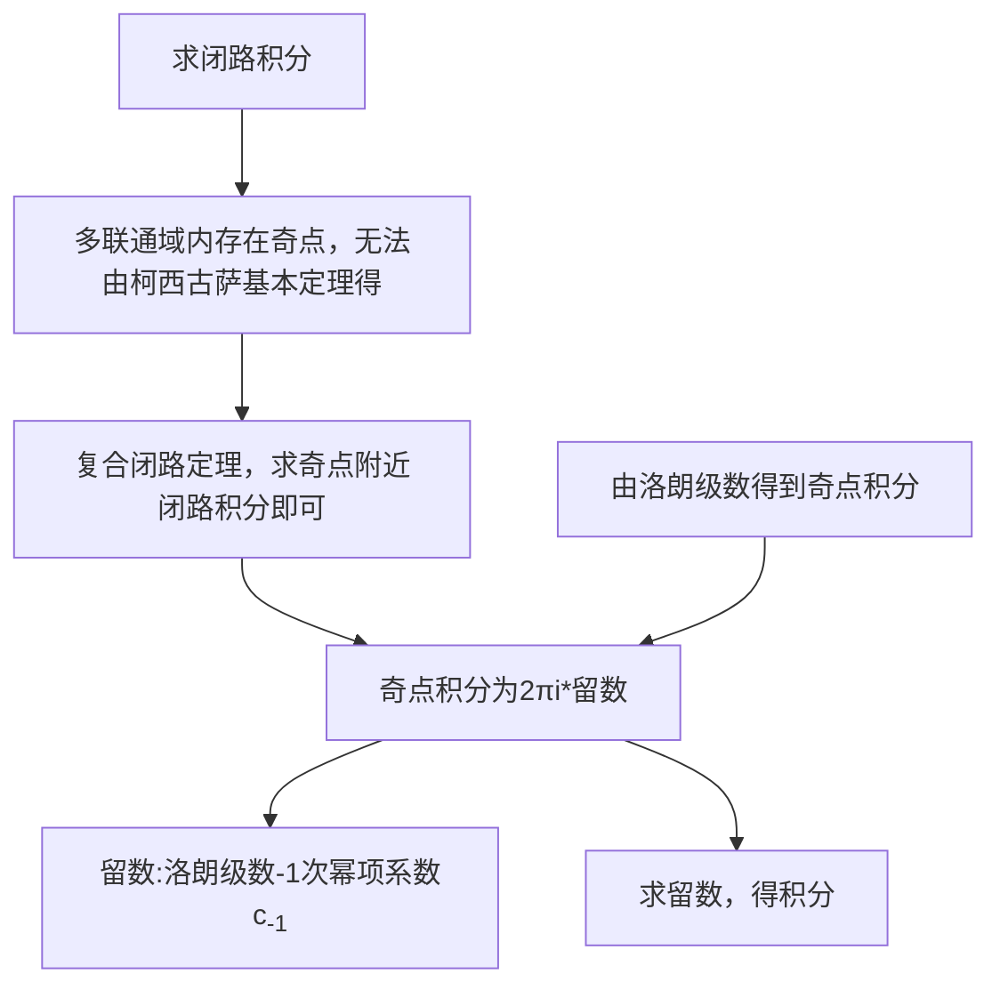

### *在某点可导*
设函数 $f(z)=u(x, y)+i v(x, y)$ 定义在区域 $D$ 内，则 $f(z)$ 在 $D$ 内**一点** $z=x+y i$ **可导**的**充要条件**是：$u(x, y)$ 与 $v(x, y)$ 在点 $(x, y)$ 可微^[注1]，并且在该点满足柯西-黎曼方程：
$$
\frac{\partial u}{\partial x}=\frac{\partial v}{\partial y}, \quad \frac{\partial u}{\partial y}=-\frac{\partial v}{\partial x}.
$$
==可微与可导==：
二元函数可微：$\Delta{u}=a\Delta{x}+b\Delta{y}+o(\sqrt{\Delta x^2+\Delta y^2})$

### 积分
参数方程法$\int_Cf(z)dz=\int_{\alpha}^{\beta}f(z(t))z'(t)dt$
第二型曲线积分: 仍然是上式，$z(t)=x(t)+iy(t)$ $z'(t)=x'(t)+iy'(t)$

### 柯西古萨基本定理/复合闭路定理
单连通域闭路曲线积分为0 
==重要积分==
$\oint \frac{1}{(z-z_0)^{n+1}}dz=\left\{\begin{matrix}2\pi i,n=0 \\ 0,n\neq0\end{matrix} \right.$

### 柯西积分公式/高阶导数定理
$f(z)=\frac{1}{2\pi i}\oint_{C}\frac{f(\tau)}{\tau-z}d\tau$
原因:z是 $\frac{f(\tau)}{\tau-z}$ 的奇点
$f^{(n)}(z)=\frac{n!}{2\pi i}\oint_{C} \frac{f(\tau)}{(\tau-z)^{n+1}}d\tau$
意义:解析函数的任意阶导数都存在且仍为解析函数
### 解析函数和调和函数的关系
#### 调和函数
两者的关系：若函数 $f(z)=u(x,y)+iv(x,y)$ 在区域 D 内解析，则 u(x,y) 和 v(x,y) 都是 D 内的调和函数。**==一定是虚部是实部的共轭调和==**
##### 调和函数的定义
设二元实函数 \(u(x,y)\) 在区域 \(D\) 内具有**二阶连续偏导数**，且满足**拉普拉斯方程**：$\frac{\partial^2 u}{\partial x^2}+\frac{\partial^2 u}{\partial y^2}=0$
则称 \(u(x,y)\) 为区域 \(D\) 内的**调和函数**。
**关于二阶连续偏导数的说明**：这个条件是为了保证拉普拉斯方程中的二阶偏导数存在且有良好的运算性质，同时也是后续推导解析函数与调和函数关系的基础——解析函数的实部和虚部天然满足该条件
##### 两者的关系
**定理**：若函数 \(f(z)=u(x,y)+iv(x,y)\) 在区域 \(D\) 内解析，则 \(u(x,y)\) 和 \(v(x,y)\) 都是 \(D\) 内的调和函数。
**证明**：
1.  由解析函数的无穷阶可导性，\(u\) 和 \(v\) 在 \(D\) 内具有任意阶连续偏导数，自然满足“二阶连续偏导数”的要求。
2.  解析函数满足**柯西-黎曼方程**：
    $\frac{\partial u}{\partial x}=\frac{\partial v}{\partial y},\quad \frac{\partial u}{\partial y}=-\frac{\partial v}{\partial x}$
3.  对第一式两边关于 \(x\) 求偏导，对第二式两边关于 \(y\) 求偏导，得
    $\frac{\partial^2 u}{\partial x^2}=\frac{\partial^2 v}{\partial y\partial x},\quad \frac{\partial^2 u}{\partial y^2}=-\frac{\partial^2 v}{\partial x\partial y}$
4.  由于二阶混合偏导数连续，$\frac{\partial^2 v}{\partial y\partial x}=\frac{\partial^2 v}{\partial x\partial y}$，两式相加得
    $\frac{\partial^2 u}{\partial x^2}+\frac{\partial^2 u}{\partial y^2}=0$
    同理可证 \(v(x,y)\) 也满足拉普拉斯方程，故 \(u,v\) 均为调和函数。

##### 共轭调和函数的定义
若 \(u(x,y)\) 是区域 \(D\) 内的调和函数，且存在调和函数 \(v(x,y)\)，使得 \(u,v\) 满足柯西-黎曼方程，则称 \(v(x,y)\) 是 \(u(x,y)\) 的**共轭调和函数**。

**注意**：
- 若 \(f(z)=u+iv\) 解析，则**虚部 \(v\) 是实部 \(u\) 的共轭调和函数**，反之不成立（即 \(u\) 不是 \(v\) 的共轭调和函数，除非 \(f(z)\) 是常数函数）。
- 共轭调和函数是**相互依赖**的，且依赖于区域 \(D\)，脱离区域谈共轭调和函数无意义。

##### 偏积分法
已知调和函数 \(u(x,y)\)，求其共轭调和函数 \(v(x,y)\) 构造解析函数 \(f(z)=u+iv\) 的步骤：
1.  由柯西-黎曼方程 \(\frac{\partial v}{\partial y}=\frac{\partial u}{\partial x}\)，对 \(y\) 积分得
    \[
    v(x,y)=\int \frac{\partial u}{\partial x}dy+\varphi(x)
    \]
    其中 \(\varphi(x)\) 是关于 \(x\) 的待定函数。
2.  对 \(v\) 关于 \(x\) 求偏导，结合柯西-黎曼方程 \(\frac{\partial v}{\partial x}=-\frac{\partial u}{\partial y}\)，得到 \(\varphi'(x)\) 的表达式。
3.  对 \(\varphi'(x)\) 积分求出 \(\varphi(x)\)（常数可忽略，不影响解析性），代入即得 \(v(x,y)\)。

##### 不定积分法
**核心公式**：若 \(f(z)=u+iv\) 解析，则 \(f'(z)=\frac{\partial u}{\partial x}+i\frac{\partial v}{\partial x}\)
- **下标含义**：\(u_x=\frac{\partial u}{\partial x}\)、\(v_x=\frac{\partial v}{\partial x}\) 分别表示 \(u\)、\(v\) 关于 \(x\) 的一阶偏导数。
- **为什么是偏导**：因为 \(u,v\) 是二元函数，依赖 \(x,y\) 两个变量，而解析函数的导数定义是基于复变量 \(z=x+iy\) 的，柯西-黎曼方程建立了复导数与实偏导数的联系，因此 \(f'(z)\) 可以用关于 \(x\) 的一阶偏导数来表示。
### 幂级数的有理运算
设 $\sum_{n=0}^{\infty} a_n z^n = f(z)$，$|z| < R_1$；$\sum_{n=0}^{\infty} b_n z^n = g(z)$，$|z| < R_2$

则当 $|z| < R = \min\{R_1, R_2\}$ 时，==在收敛半径内==
- $\sum_{n=0}^{\infty} (a_n \pm b_n)z^n = f(z) \pm g(z)$
- $\sum_{n=0}^{\infty} c_n z^n = f(z) \cdot g(z)$，其中 $c_n = a_0b_n + a_1b_{n-1} + \cdots + a_nb_0$
==也就是说，级数结果直接加减乘除，等于级数项加减乘除==
### 逐项求导与积分
幂级数 $\sum_{n=0}^{\infty} c_n(z-a)^n$ 在其收敛圆内可以逐项求导和逐项积分。
**逐项求导性质**：$\sum_{n=1}^{\infty} nc_n(z-a)^{n-1} = f'(z)$，$|z-a| < R$
**逐项积分性质**：$\int_C f(z)dz = \sum_{n=0}^{\infty} c_n \int_C (z-a)^n dz$，其中 $C$ 在收敛圆内

### 泰勒级数
设$f(z)=c_0+c_1(z-z_0)+...$ 求n阶导数，$f^{(n)}(z)=c_{n}{n!}$ 代入$z_0$得常数$c_{n}=\frac{f^{(n)}(z_0)}{n!}$ ($f^{(n)}(z)=0+0+0+0+...+c_{n}*n!+c_{n+1}(n+1)!(z-z_0)+...$ 代入z_0只留下$c_n$)
则$f(z) = \sum_{n=0}^{\infty}\large \frac{f^{(n)}(z_0)}{n!}(z-z_0)^n$ ，
$z_0$是手动给定的，不是奇点。 $c_n = \frac{f^{(n)}(z_0)}{n!}$ 称为泰勒系数。
#### ==常见函数的泰勒展开式==
- $e^z = \sum_{n=0}^{\infty} \frac{z^n}{n!} = 1 + z + \frac{z^2}{2!} + \frac{z^3}{3!} + \cdots$，$(|z| < +\infty)$
- $\sin z = \sum_{n=0}^{\infty} \frac{(-1)^n}{(2n+1)!}z^{2n+1} = z - \frac{z^3}{3!} + \frac{z^5}{5!} - \cdots$，$(|z| < +\infty)$
- $\cos z = \sum_{n=0}^{\infty} \frac{(-1)^n}{(2n)!}z^{2n} = 1 - \frac{z^2}{2!} + \frac{z^4}{4!} - \cdots$，$(|z| < +\infty)$
- $\frac{1}{1-z} = \sum_{n=0}^{\infty} z^n = 1 + z + z^2 + \cdots$，$(|z| < 1)$

### 一、双边幂级数
双边幂级数：$\sum_{n=-\infty}^{\infty} c_n(z-z_0)^n = \cdots + c_{-n}(z-z_0)^{-n} + \cdots + c_{-1}(z-z_0)^{-1} + c_0 + c_1(z-z_0) + \cdots + c_n(z-z_0)^n + \cdots$
双边幂级数可分为两部分：
- 负幂项部分（主要部分）：$\sum_{n=1}^{\infty} c_{-n}(z-z_0)^{-n}$
- 正幂项部分（解析部分）：$\sum_{n=0}^{\infty} c_n(z-z_0)^n$
双边幂级数的收敛区域为圆环域：$R_1 < |z-z_0| < R_2$
### 二、洛朗定理
设函数 $f(z)$ 在圆环域 $D: R_1 < |z-z_0| < R_2$ 内处处解析，则在此圆环域内 $f(z)$ 可以展开成双边幂级数：$z_0$是奇点
$$f(z) = \sum_{n=-\infty}^{\infty} c_n(z-z_0)^n$$
其中 $c_n = \frac{1}{2\pi i} \int_C \frac{f(\zeta)}{(\zeta-z_0)^{n+1}} d\zeta$，$(n=0, \pm 1, \pm 2, \ldots)$

## 级数展开求法
1. 变形成常见函数的泰勒展开式
2. 确认复合常用展开式的范围
3. 套公式
关于洛朗级数:注意符合范围即可。展开式的求解中，洛朗级数无特殊内容，与其他展开相同。
题目:未央网课

### 孤立奇点及其分类
设 $z_0$ 为 $f(z)$ 的奇点，且 $f(z)$ 在 $z_0$ 的去心领域 $0 < |z-z_0| < \delta$ 内解析，则称 $z_0$ 为 $f(z)$ 的孤立奇点。
根据函数在孤立奇点的洛朗级数展开式中负幂项的情况，孤立奇点分为三类：
1. **可去奇点**：洛朗级数中无 $(z-z_0)$ 的负幂项 (极限存在(可以代入展开式)，得$\lim\limits_{z\to{z_0}} f(z) = 常数$，如果是有负幂项，代入 $z_0$会得到分母为0，无解)     e.g.泰勒展开里的$z_0$ 
2. **极点**：洛朗级数中只有有限个 $(z-z_0)$ 的负幂项  $f(z_0)$ 极限存在且无穷大
3. **本性奇点**：洛朗级数中有无限个 $(z-z_0)$ 的负幂项  $f(z_0)$ 极限不存在且不为无穷大
#### 可去奇点
设 $z_0$ 为 $f(z)$ 的孤立奇点，且在 $f(z)$ 的解析去心领域 $0 < |z-z_0| < \delta$ 内的洛朗级数无 $(z-z_0)$ 的负幂项，则称 $z_0$ 的可去奇点。
**性质**：$z_0$ 为 $f(z)$ 的可去奇点 $\Leftrightarrow \lim_{z \to z_0} f(z)$ 存在且有限。
**例**：$z=0$ 为 $\frac{\sin z}{z}$ 的可去奇点，因为 $\lim_{z \to 0} \frac{\sin z}{z} = 1$。
#### 极点
设 $z_0$ 为 $f(z)$ 的孤立奇点，且在 $f(z)$ 的解析去心领域内的洛朗级数中只有有限个 $(z-z_0)$ 的负幂项，则称 $z_0$ 为 $f(z)$ 的极点。
如果 $f(z)$ 在 $z_0$ 附近的洛朗展开式为：
$$f(z) = \frac{c_{-m}}{(z-z_0)^m} + \frac{c_{-m+1}}{(z-z_0)^{m-1}} + \cdots + \frac{c_{-1}}{z-z_0} + c_0 + c_1(z-z_0) + \cdots$$
其中 $c_{-m} \neq 0$，则称 $z_0$ 为 $f(z)$ 的 $m$ 级极点。
**性质**：$z_0$ 为 $f(z)$ 的极点 $\Leftrightarrow \lim_{z \to z_0} f(z) = \infty$。
**极点的判断**：如果 $f(z) = \frac{\varphi(z)}{(z-z_0)^m}$，其中 $\varphi(z)$ 在 $z_0$ 解析且不为零，则 $z_0$ 为 $f(z)$ 的 $m$ 级极点。
#### 本性奇点
设 $z_0$ 为 $f(z)$ 的孤立奇点，且在 $f(z)$ 的解析去心领域内的洛朗级数中有无限个 $(z-z_0)$ 的负幂项，则称 $z_0$ 为 $f(z)$ 的本性奇点。
**性质**：$z_0$ 为 $f(z)$ 的本性奇点 $\Leftrightarrow \lim_{z \to z_0} f(z)$ 不存在也不为无穷大。
**例**：$z=0$ 为 $e^{1/z}$ 的本性奇点。

####  零点
若函数 $f(z) = (z-z_0)^m \varphi(z)$，其中 $\varphi(z)$ 在 $z_0$ 解析且不为零，$m \geq 1$，则称 $z_0$ 为 $f(z)$ 的 $m$ 级零点。
二、零点级数的确定
$z_0$ 为 $f(z)$ 的 $m$ 级零点 $\Leftrightarrow f(z_0) = f'(z_0) = \cdots = f^{(m-1)}(z_0) = 0$，且 $f^{(m)}(z_0) \neq 0$。
三、零点与极点的关系
如果 $z_0$ 是 $g(z)$ 的 $m$ 级零点，则 $z_0$ 是 $\frac{1}{g(z)}$ 的 $m$ 级极点。
**例**：求 $f(z) = z^3(z-1)$ 的零点及级数。
解：$f(z) = z^3(z-1)$ 的零点有 $z=0$（3级零点）和 $z=1$（1级零点）。

#### 留数
![[IMG_7888.png]]
![[IMG_7890.png]]

判断:
可去奇点 $z_0$ 处洛朗级数无负幂项  极限存在为常数
本性奇点 $z_0$ 处洛朗级数有无穷多负幂项  极限不存在且不为♾️
m级极点 $z_0$ 处洛朗级数负幂项最高为-m次  极限不存在但为♾️
m级零点 