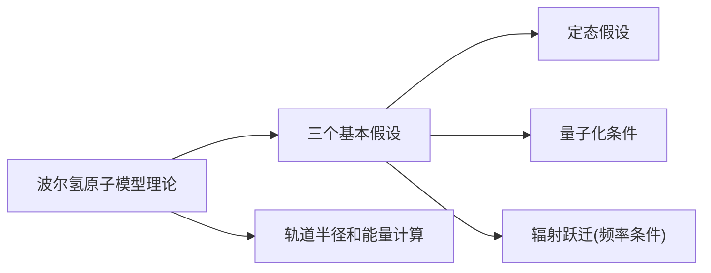

# 第三篇 电磁学
## 第十二章 真空中的静电场
### §12.1 电荷 库仑定律
#### 一、电荷的基本性质
1. **两种电荷**：自然界只存在两种电荷，即正电荷和负电荷。同种电荷相斥，异种电荷相吸。
2. **电荷的量子化**：任何带电体的电荷量都是电子电荷e的整数倍，即 $q = \pm Ne$，其中 $e = 1.60217733 \times 10^{-19} C$
3. **电荷守恒定律**：在一个与外界没有电荷交换的系统内，正、负电荷的代数和在任何物理过程中始终保持不变。

#### 二、点电荷
当带电体本身的线度比起它与其他带电体之间的距离小得多时，该带电体可以看作一个带电的几何点，称为点电荷。点电荷是带电体的理想化模型。

#### 三、库仑定律
真空中两个静止的点电荷之间相互作用力的大小与这两个点电荷的电量的乘积成正比，与它们之间距离的平方成反比，作用力的方向沿着它们的连线。

$F = \frac{1}{4\pi\varepsilon_0}\frac{q_1q_2}{r^2}$

矢量形式：$\vec{F_{12}} = \frac{1}{4\pi\varepsilon_0}\frac{q_1q_2}{r^2}\vec{r_{12}}$

其中 $\varepsilon_0 = 8.854187817 \times 10^{-12} C^2 \cdot N^{-1} \cdot m^{-2}$ 为真空介电常数。

库仑定律的适用条件：
1. 真空中
2. 静止的点电荷
3. 静电荷之间的作用

#### 四、静电场力叠加原理
当空间有几个点电荷同时存在时，任一点电荷所受的总的静电力等于其他各点电荷单独存在时分别作用于该电荷的静电力的矢量和。

### §12.2 真空中的静电场 电场强度
#### 一、电场
电荷之间的相互作用是通过电场来实现的。电场是物质的一种特殊形态，具有能量和动量。

#### 二、电场强度
电场中某点的电场强度在数值上等于单位正电荷在该点所受的电场力。


其中 $q_0$ 是试探电荷，且 $q_0 \to 0$ 以避免对原电场的影响。

电场强度的单位：$N \cdot C^{-1}$ 或 $V \cdot m^{-1}$

#### 三、电场强度的计算
1. **点电荷的电场强度**：
   $\vec{E} = \frac{1}{4\pi\varepsilon_0}\frac{q}{r^2}\vec{r_0}$

2. **点电荷系的电场强度**（场强叠加原理）：
   $\vec{E} = \sum_{i=1}^{n} \vec{E_i} = \sum_{i=1}^{n} \frac{1}{4\pi\varepsilon_0}\frac{q_i}{r_i^2}\vec{r_{0i}}$

3. **连续分布电荷的电场强度**：
   - 电荷体密度：$\rho = \frac{dq}{dV}$，$d\vec{E} = \frac{1}{4\pi\varepsilon_0}\frac{dq}{r^2}\vec{r_0} = \frac{1}{4\pi\varepsilon_0}\frac{\rho dV}{r^2}\vec{r_0}$
   - 电荷面密度：$\sigma = \frac{dq}{dS}$，$d\vec{E} = \frac{1}{4\pi\varepsilon_0}\frac{\sigma dS}{r^2}\vec{r_0}$
   - 电荷线密度：$\lambda = \frac{dq}{dl}$，$d\vec{E} = \frac{1}{4\pi\varepsilon_0}\frac{\lambda dl}{r^2}\vec{r_0}$

   总电场强度为：$\vec{E} = \int d\vec{E}$

#### 四、典型带电体的电场强度
1. **无限长均匀带电直线**（线电荷密度为λ）：
   $E = \frac{\lambda}{2\pi\varepsilon_0 r}$

2. **半径为R的均匀带电圆环轴线上一点**（总电荷为q）：
   $E = \frac{1}{4\pi\varepsilon_0}\frac{qx}{(R^2+x^2)^{3/2}}$

3. **半径为R的均匀带电圆盘轴线上一点**（电荷面密度为σ）：
   $E = \frac{\sigma}{2\varepsilon_0}\left(1-\frac{x}{\sqrt{R^2+x^2}}\right)$

4. **无限大均匀带电平面**（电荷面密度为σ）：
   $E = \frac{\sigma}{2\varepsilon_0}$

5. **电偶极子**（电偶极矩 $\vec{p_e} = q\vec{l}$，其中 $\vec{l}$ 由负电荷指向正电荷）：
   - 延长线上一点：$E = \frac{1}{2\pi\varepsilon_0}\frac{p_e}{r^3}$
   - 中垂线上一点：$E = \frac{1}{4\pi\varepsilon_0}\frac{p_e}{r^3}$

### §12.3 电场强度通量 高斯定理
#### 一、电场线
电场线是用来形象描述电场的曲线，曲线上每一点的切线方向表示该点电场强度的方向，电场线的疏密表示电场强度的大小。

电场线的性质：
1. 电场线起于正电荷（或无穷远处），终止于负电荷（或无穷远处）
2. 任何两条电场线不能相交
3. 静电场的电场线不闭合

#### 二、电场强度通量
电场强度通量是通过电场中某一曲面的电场线条数。

- 对于垂直于电场方向的平面：$\Phi_e = ES$
- 对于任意曲面：$d\Phi_e = \vec{E} \cdot d\vec{S} = EdS\cos\theta$
- 通过整个曲面的电通量：$\Phi_e = \int_S \vec{E} \cdot d\vec{S}$

#### 三、高斯定理
真空中的静电场内，通过任意闭合曲面的电场强度通量等于该闭合曲面所包围的电量的代数和除以真空介电常数。

$\oint_S \vec{E} \cdot d\vec{S} = \frac{1}{\varepsilon_0}\sum q_{内}$

高斯定理的物理意义：
- 电场强度通量只与闭合曲面内的电荷有关，与闭合曲面外的电荷无关
- 静电场是有源场，电荷是静电场的源

#### 四、高斯定理的应用
利用高斯定理计算电场强度的条件：电荷分布具有高度的对称性（球对称、轴对称、面对称）

典型的对称性分布：
1. **球对称分布**（如均匀带电球体、均匀带电球面）：
   - 高斯面：同心球面
   - 电场强度：$E = \frac{1}{4\pi\varepsilon_0}\frac{Q}{r^2}$（r>R时），$E = \frac{1}{4\pi\varepsilon_0}\frac{Qr}{R^3}$（r<R时）

2. **轴对称分布**（如无限长均匀带电直线、无限长均匀带电圆柱）：
   - 高斯面：同轴圆柱面
   - 电场强度：$E = \frac{\lambda}{2\pi\varepsilon_0 r}$

3. **面对称分布**（如无限大均匀带电平面、平行平面）：
   - 高斯面：柱形高斯面
   - 电场强度：$E = \frac{\sigma}{2\varepsilon_0}$

### §12.4 静电场的环路定理 电势
#### 一、静电场力做功的特点
静电场力做功与路径无关，只与始末位置有关。这表明静电场是保守场，静电场力是保守力。

电场强度沿任意闭合路径的线积分等于零：$\oint_L \vec{E} \cdot d\vec{l} = 0$

#### 二、电势能
电荷在静电场中具有的势能称为电势能。电荷q在静电场中从a点移动到b点时，电场力做的功等于电势能的减少。

$A_{ab} = W_a - W_b$

电势能的参考点通常选择在无穷远处，即 $W_{\infty} = 0$。

#### 三、电势
电场中某点的电势在数值上等于单位正电荷在该点的电势能。

$U_a = \frac{W_a}{q_0}$

电势是标量，可正可负。

电势的计算：
1. **点电荷的电势**：$U = \frac{1}{4\pi\varepsilon_0}\frac{q}{r}$
2. **点电荷系的电势**（电势叠加原理）：$U = \sum_{i=1}^{n} U_i = \sum_{i=1}^{n} \frac{1}{4\pi\varepsilon_0}\frac{q_i}{r_i}$
3. **连续分布电荷的电势**：
   - 体分布：$U = \frac{1}{4\pi\varepsilon_0}\int_V \frac{\rho dV}{r}$
   - 面分布：$U = \frac{1}{4\pi\varepsilon_0}\int_S \frac{\sigma dS}{r}$
   - 线分布：$U = \frac{1}{4\pi\varepsilon_0}\int_L \frac{\lambda dl}{r}$

#### 四、电势差
两点间的电势差等于将单位正电荷从一点移动到另一点时电场力做的功。

$U_{ab} = U_a - U_b = \int_a^b \vec{E} \cdot d\vec{l}$

### §12.5 等势面 电场强度与电势的微分关系
#### 一、等势面
电场中电势相等的点构成的曲面称为等势面。

等势面的性质：
1. 在任何静电场中，沿等势面移动电荷时，电场力不做功
2. 电场线与等势面处处正交
3. 电场线的方向是电势降低的方向
4. 等势面密集的地方电场强度大，等势面稀疏的地方电场强度小

#### 二、电场强度与电势的微分关系
电场强度等于电势梯度的负值：$\vec{E} = -\nabla U = -\left(\frac{\partial U}{\partial x}\vec{i} + \frac{\partial U}{\partial y}\vec{j} + \frac{\partial U}{\partial z}\vec{k}\right)$

在直角坐标系中：
- $E_x = -\frac{\partial U}{\partial x}$
- $E_y = -\frac{\partial U}{\partial y}$  
- $E_z = -\frac{\partial U}{\partial z}$

### $1 稳恒电流的基本概念
>通过任意导体界面的电流强度不随时间变化的电流
#### 一、电流和电流密度
##### 电流
>大量载流子定向运动
>形成条件：导体内有可移动电荷、导体两端有电压差
##### 电流强度
>单位时间内通过某截面的电量
##### 电流密度矢量
>通过垂直于载流子运动方向的单位面积的**电流强度**
$\delta = \frac{dl}{ds_\perp}$
$I = \int_S{\overrightarrow{\delta}\cdot{dS}}$

#### 电流密度与电荷的运动的关系


### $2磁场 磁感应强度
#### 安培分子电流假说
>物质的每个分子都存在着回路电流
>磁场现象的本源是电荷的运动
#### 磁场
1. **磁场的作用本质**
	磁作用本质：磁场（磁体、电流、运动电荷产生磁场，相互）
	磁场是一种物质，具有物质性
	电场与电荷有关，磁场与运动电荷有关
	
2. **磁感应强度B**
	**磁场方向**：场中各点有一特定方向，电荷沿该方向运动不受磁力作用
	垂直于磁场方向运动，电荷受磁力最大
	运动电荷受磁场力方向垂直于运动方向和磁场方向
	方向：该点小磁针N极所指方向

#### 运动电荷产生的磁场
**电荷元**: de = dE....
**电流元**: 运动电荷组成的体系$Id\overrightarrow{l} =....$
$d\overrightarrow{B} = k\frac{Idlsin\alpha}{r^2}$,

>#### 一个运动电荷产生的磁场有何特性：
>(I = nqvS)$d \overrightarrow{B}=\frac{\mu}{4\pi}\frac{(qnSv)d\overrightarrow{l}\times{\overrightarrow{r_{0}}}}{r^{2}}$
>每个以速度v运动，电荷量为q的电荷产生的磁感应强度：$\overrightarrow{B}=\frac{d\overrightarrow{B}}{d \overrightarrow{N}}=\frac{\mu}{4\pi}\frac{q \overrightarrow{v}\times{\overrightarrow{r_{0}}}}{r^{2}}$

在真空中磁导率为$\begin{matrix}dB = \frac{\mu_0}{4\pi}\frac{Id\overrightarrow{l}\times{\overrightarrow{r_0}}}{r^2}\\ \mu_0 = 4\pi\times10^{-7}N\cdot A^{-2} \end{matrix}$
方向：手指指向电流元方向，弯曲向单位矢量方向(从电流元指向所求点位置)，拇指方向是场强方向
#### 毕-萨定律一般步骤
1. 选择电流元Idl
2. 写出此电流元在某点场强大小
3. 确定dB方向
4. 建立坐标系，求分量$dB_x$
5. 积分$B_x = \int{dB_x}$
6. 矢量和$\overrightarrow{B}=B_x\overrightarrow{i}+B_y\overrightarrow{j}+B_z\overrightarrow{k}$
##### 经典类型
##### 1. 有限长直导线的磁感应强度
>P点对于导线两端连线的夹角(水平分割)$B =\frac{\mu_0 I}{4 \pi a}(\sin{\beta_2}-\sin{\beta_1})$
>导线无限长：$\beta_2 = \frac{\pi}{2}\beta_1 = -\frac{\pi}{2}\;B =\frac{\mu_0 I}{2 \pi a}$
>导线半无限长：$B =\frac{\mu_0 I}{4 \pi a}$
>P点在导线延长线上$B=0$

##### 2. 圆环，P点位于轴线
>$B = \frac{\mu_0 IR^2}{2(R^2+x^2)^{\frac{3}{2}}}$

### $4 表述磁场性质的两条定理
#### 一、磁场的高斯定理
>磁通量：通过磁场任一曲面的磁场线条数
>$d\Phi_{m}=BdS_⊥=BdS\cos\theta=\overrightarrow{B}d\overrightarrow{S}$
>因为磁场线闭合，$\oint_S{\overrightarrow{B}d\overrightarrow{S}} = 0$

无源场

#### 二、安培环路定理
>$\oint_l{\overrightarrow{B}d\overrightarrow{l}} = ?$
>1. 类比，研究特殊情况：无限长直导线
>![[Physics2_C3S4.jpg]]
>此环路上，磁场大小方向相同。
>2. 平面内任意环路
>$\oint_l{\overrightarrow{B}\cdot d\overrightarrow{l}}=\mu_0\sum\limits_{内}{I_i}$

非保守场                                                                                                              
#### 三、安培环路定理的应用
1. 根据电流分布研究磁场分布
2. 选取适当的闭合环路：通过所有磁场的点、环路上各点B=常量、形状简单
3. 选择绕向，确定电流正负(右手螺旋法则)

#### 总结


### $5 磁场对电流的作用
#### 洛伦兹力
$\overrightarrow{F_L}=q\overrightarrow{v}\times\overrightarrow{B}$
普遍情况下，空间中电场与磁场同时存在
$\overrightarrow{F}=$

#### 三、有磁介质时磁场基本性质
1. **磁场的高斯定理**：$\oint_S{\overrightarrow{B}d\overrightarrow{S}} = 0$，磁场是无源场
2. **安培环路定理**：$\oint_l{\overrightarrow{B}\cdot d\overrightarrow{l}}=\mu\sum_{内}{I}=\mu_{0}\mu_r\sum_{内}{I_i}$
	其中 $\mu_0$ 是真空磁导率，$\mu_r$ 是相对磁导率，$\mu=\mu_0\mu_r$ 是总磁导率
	引入磁场强度矢量：$\overrightarrow{H}=\frac{\overrightarrow{B}}{\mu}$
	则有：$\oint_l{\overrightarrow{H}\cdot d\overrightarrow{l} = \sum_内{I_i}}$
	磁场强度是一个辅助物理量，反映磁场分布，与传导电流有关

#### 四、利用磁场强度的安培环路定理进行磁场计算
在有磁介质时，使用磁场强度 $\overrightarrow{H}$ 的安培环路定理往往更方便。

## 第十三章 磁场对电流的作用
### §13.1 磁场对运动电荷的作用
#### 一、洛伦兹力
运动电荷在磁场中受到的力称为洛伦兹力：
$\overrightarrow{F_L}=q\overrightarrow{v}\times\overrightarrow{B}$

洛伦兹力的特点：
1. 力的方向垂直于 $\overrightarrow{v}$ 和 $\overrightarrow{B}$ 所决定的平面
2. 洛伦兹力不做功，只改变速度方向，不改变速度大小
3. 在复合场中，带电粒子受到的总力为：$\overrightarrow{F}=q\overrightarrow{E}+q\overrightarrow{v}\times\overrightarrow{B}$（洛伦兹广义力）

#### 二、带电粒子在匀强磁场中的运动
1. **v//B**：匀速直线运动
2. **v⊥B**：匀速圆周运动，半径 $R=\frac{mv}{qB}$，周期 $T=\frac{2\pi m}{qB}$
3. **v与B成任意角θ**：螺旋线运动，螺距 $h=v_{//}T=\frac{2\pi mv\cos\theta}{qB}$

#### 三、霍尔效应
当电流垂直于外磁场通过导体时，在垂直于磁场和电流的方向上会产生一个横向电势差，这种现象称为霍尔效应。

霍尔电压：$U_H = \frac{IB}{nqd}$，其中n为载流子数密度，d为导体厚度。

### §13.2 磁场对载流导线的作用
#### 一、安培力
磁场对电流元的作用力为：$d\overrightarrow{F}=I d\overrightarrow{l}\times\overrightarrow{B}$

对整个载流导线的作用力：$\overrightarrow{F}=\int d\overrightarrow{F}=\int I d\overrightarrow{l}\times\overrightarrow{B}$

#### 二、磁场对载流线圈的作用
对于在匀强磁场中的平面载流线圈：
- 磁力矩：$\overrightarrow{M}=\overrightarrow{P_m}\times\overrightarrow{B}$，其中 $\overrightarrow{P_m}=IS\overrightarrow{n}$ 为磁偶极矩
- 线圈所受合力为零
- 当 $\overrightarrow{P_m}//\overrightarrow{B}$ 时，力矩为零，为稳定平衡
- 当 $\overrightarrow{P_m}\perp\overrightarrow{B}$ 时，力矩最大

## 第十四章 磁介质中的磁场
### §14.1 磁介质的磁化
#### 一、磁介质的分类
1. **顺磁质**：$\mu_r > 1$（微大于1），如铝、铂、氧等
2. **抗磁质**：$\mu_r < 1$（微小于1），如铜、银、金、水等
3. **铁磁质**：$\mu_r >> 1$，如铁、钴、镍等

#### 二、磁化强度
磁化强度：$\overrightarrow{M}=\frac{\sum\overrightarrow{P_{mi}}}{\Delta V}$，表示单位体积内的磁矩

磁化电流：$\oint_l \overrightarrow{M}\cdot d\overrightarrow{l} = I'$，其中I'是磁化电流

### §14.2 有磁介质时的安培环路定理
在有磁介质时：$\oint_l \overrightarrow{H}\cdot d\overrightarrow{l} = I_0$，其中I_0为传导电流

## 第十五章 电磁感应
### §15.1 电磁感应定律
#### 一、法拉第电磁感应定律
电路中感应电动势的大小，跟穿过这一回路的磁通量的变化率成正比：
$\varepsilon_i = -\frac{d\Phi_m}{dt}$

负号表示感应电动势的方向总是阻碍磁通量的变化（楞次定律）

#### 二、动生电动势和感生电动势
1. **动生电动势**：导体在恒定磁场中运动产生的电动势
   $\varepsilon = \int_{L} (\overrightarrow{v}\times\overrightarrow{B})\cdot d\overrightarrow{l}$

2. **感生电动势**：磁场变化引起磁通量变化而产生的电动势
   $\varepsilon = -\frac{\partial \overrightarrow{B}}{\partial t}$

### §15.2 自感和互感
#### 一、自感现象
由于回路中电流变化而在自身回路中产生感应电动势的现象。

自感系数：$L = \frac{\Psi}{I} = \frac{N\Phi}{I}$，单位：亨利(H)

自感电动势：$\varepsilon_L = -L\frac{dI}{dt}$

#### 二、互感现象
当一个回路中的电流发生变化时，在邻近另一个回路中产生感应电动势的现象。

互感系数：$M = \frac{\Psi_{21}}{I_1} = \frac{N_2\Phi_{21}}{I_1}$，单位：亨利(H)

互感电动势：$\varepsilon_2 = -M\frac{dI_1}{dt}$

### §15.3 磁场的能量
#### 一、自感磁能
线圈中建立电流I时，磁场具有的能量为：$W_m = \frac{1}{2}LI^2$

#### 二、磁场能量密度
磁场能量密度：$w_m = \frac{dW_m}{dV} = \frac{1}{2}\frac{B^2}{\mu_0}$（真空中）
在磁介质中：$w_m = \frac{1}{2}\frac{B^2}{\mu} = \frac{1}{2}\overrightarrow{B}\cdot\overrightarrow{H}$

## 第十六章 麦克斯韦电磁场理论
### §16.1 位移电流
#### 一、位移电流的概念
麦克斯韦提出：变化的电场也能激发磁场，这种变化电场等效于一种电流，称为位移电流。

位移电流密度：$\overrightarrow{J_d} = \varepsilon_0\frac{\partial\overrightarrow{E}}{\partial t}$

位移电流：$I_d = \int_S \overrightarrow{J_d}\cdot d\overrightarrow{S} = \varepsilon_0\frac{d\Phi_e}{dt}$

全电流：$I_{全} = I_{传导} + I_d$

#### 二、麦克斯韦方程组的积分形式
1. $\oint_S \overrightarrow{B}\cdot d\overrightarrow{S} = 0$  (磁场高斯定理)
2. $\oint_L \overrightarrow{E}\cdot d\overrightarrow{l} = -\frac{d\Phi_m}{dt}$  (法拉第电磁感应定律)
3. $\oint_S \overrightarrow{D}\cdot d\overrightarrow{S} = \sum q$  (电场高斯定理)
4. $\oint_L \overrightarrow{H}\cdot d\overrightarrow{l} = I + \frac{d\Phi_D}{dt}$  (全电流安培环路定理)

### §16.2 电磁波
#### 一、电磁波的基本性质
1. 横波性质：$\overrightarrow{E}$、$\overrightarrow{B}$、$\overrightarrow{v}$ 三者相互垂直
2. 传播速度：$c = \frac{1}{\sqrt{\mu_0\varepsilon_0}} = 3\times10^8 m/s$
3. 同步变化：$\frac{E}{B} = c$
4. 能量传播：电磁波能量密度 $w = \frac{1}{2}\varepsilon_0E^2 + \frac{1}{2\mu_0}B^2$
5. 能流密度（坡印廷矢量）：$\overrightarrow{S} = \overrightarrow{E}\times\overrightarrow{H}$

## 第四章 电磁感应与电磁场
世界是对称和谐的：奥斯特 电流→磁场  磁场→？电流     法拉第经过了10年的努力：电磁感应定律

# 第四篇 热学
- **热学的研究对象**
	热现象：凡与温度有关的现象
	热运动：宏观物体内部大量微观粒子（分子、原子、电子）的无规则运动。
	热运动是热现象的**微观本质**，热现象是热运动的**宏观表现**。
- 微观量与宏观量
	微观量：每一个运动着的分子或原子都具有的质量、速度、动量、能量等量。
	宏观量：表征大量分子集体特性的物理量，如温度、压强、体积等量。
	宏观量与微观量的内在联系表现在大量分子杂乱无章的热运动遵从一定的统计规律性上。在实验中，所测量到的宏观量只是大量分子热运动（微观量）的统计平均值。
- 热学的研究方法
	热运动的统计描述方法出发形成了分子物理学—统计物理学
	由宏观方法出发，发展成为热力学
## 第一章 气体动理论 
### §1 分子热运动与统计规律
 ````mermaid
%%{init: {'theme': 'default', 'flowchart': {'useMaxWidth': true}}}%%
 graph LR
 G-->P
 G-->C
 P["一、气体动理论基本观点"]
 P-->P1["1.分子的观点"]
 P1-->P1A[宏观物质]
 P1A-->|"组成"|P1B[分子]
 P-->P2["2.分子运动观点"]
 P2-->P2A[扩散现象]
 P2-->P2B[布朗运动]
 P-->P3["3.分子力的观点"]
 P3-->P3A[分组相互作用力]
 C["二、统计规律性的基本概念"]
 C-->C1["1.概率"]
 C1-->C1A[定义]
 C1-->C1B[概率归一化条件]
 C1-->C1C["概率密度(概率分布函数)"]
 C-->C2["2.统计平均值"]
 C-->C3["3.统计基本假设"]
 ````
**概率定义**：$P_i=\lim\limits_{N\to\infty}\frac{N_{i}}{{N}}$
**概率归一化条件**：$\sum\limits_{i=1}^nP_i=1$
**概率密度（概率分布函数）**：若事件A的量值x可以连续变化，设A出现在某一间隔$\Delta{x}$内的概率为$\Delta{P(x)}$则 $f(x)=\lim\limits_{\Delta{x}\to{0}}{\frac{\Delta{P}}{\Delta{x}}}=\frac{dP}{dx}$
### §2理想气体状态方程

| 概念          | 关键公式 / 描述                                                                                         | 备注                                                                |
| ----------- | ------------------------------------------------------------------------------------------------- | ----------------------------------------------------------------- |
| **宏观 ↔ 微观** | 宏观量 = 微观量统计平均                                                                                     | 例：压强 $p$、温度 $T$ 为宏观量；分子速度 $v$、动能 $E_k$ 为微观量                       |
| **三大基本观点**  | ① 物质由大量分子组成，分子间有空隙<br>② 分子永不停息做无规则热运动（扩散、布朗运动）<br>③ 分子间存在引力和斥力，平衡距离 $d_0\sim10^{-10}\ \mathrm{m}$ | 布朗运动剧烈程度 $\propto T$                                              |
| **统计规律性**   | 大量偶然事件 → 必然分布（伽尔顿板）                                                                               | 概率归一：$\displaystyle\sum_i P_i=1$ 或 $\displaystyle\int f(x)\,dx=1$ |
| **统计平均值**   | 离散：$\langle x\rangle=\sum_i x_i P_i$<br>连续：$\langle x\rangle=\int x f(x)\,dx$                     | $f(x)$ 为概率密度                                                      |

| 概念           | 关键公式 / 描述                                    | 备注                                                                          |
| ------------ | -------------------------------------------- | --------------------------------------------------------------------------- |
| **理想气体模型**   | ① 分子质点化<br>② 除碰撞外无相互作用<br>③ 弹性碰撞             | 适用条件：低压、高温                                                                  |
| **状态参量**     | 压强 $p$，体积 $V$，温度 $T$                         | 平衡态：宏观量不随时间变化                                                               |
| **理想气体状态方程** | $$pV = \nu RT = \frac{m}{M_{\text{mol}}}RT$$ | $R=8.31\ \mathrm{J/(mol\cdot K)}$<br>$\nu$：物质的量                             |
| **分子数形式**    | $$p = nkT$$                                  | $n=\frac{N}{V}$：分子数密度<br>$k=\frac{R}{N_A}=1.38\times10^{-23}\ \mathrm{J/K}$ |
| **摩尔质量关系**   | $$M_{\text{mol}} = N_A m_0$$                 | $m_0$：单个分子质量                                                                |

### §3 理想气体的压强和温度的统计意义
#### 一、平衡态理想气体的统计假设
各种统计值：如平均速率 方均速率
#### 二、理想气体压强统计意义

$\begin{matrix}\text{单个分子碰撞容器壁，给予容器壁冲量}\to\text{单个分子1秒冲量}\to\text{多个分子冲量}\\\to\text{冲量统计值}\to\text{压力}\to\text{一个面的压强}\xrightarrow{各个方向速度平方统计值相同}\text{总压强}\end{matrix}$

动能统计平均值：$\overline{E_k}=\frac{1}{2}m_0\overline{v^2}$ 将压强转为动能表示：$p=\frac{1}{3}nm_{0}\bar{v^2}=\frac{2}{3}n\overline{E_k}$ 
>*宏观量**压强**的微观本质、微观统计含义*
#### 三、温度的微观意义
温度与微观粒子的动能有关
````col
```col-md
由压强 $\large\left. \begin{matrix}p=nkT\\p=\frac{2}{3}n\overline{E_k}\end{matrix}\right\}\to T=\frac{2}{3k}\overline{E_k}$
```
```col-md
结论：
温度标志着物体内部大量分子无规则运动剧烈程度，是分子热运动平均平动动能的亮度
```
````
\*k是什么？$k=\frac{R}{N_A}$ $M_mol=m_0N_A$
$\large\sqrt{\overline{v^2}}=v_{rms}$ 方均根速率，是速率的量纲  其它表示：$\large\sqrt{\frac{3kT}{m_{0}}}=\sqrt{\frac{3RT}{M_{mol}}}$

习题：例一[^4.1.3-1]例二[^4.1.3-2]

### §4 能量按自由度均分定理
分子动能=平动+转动动能+振动动能
\*振动可以被视为平动吗？

#### 一、自由度
确定一个物体所需的独立坐标数目
##### 1. 刚体的自由度
(1) 任意刚体：平动 $(x,y,z)$ 转动
(2)
##### 2. 刚性分子自由度 (不考虑分子的振动)

|     | 平动自由度 $t$ |     |     |
| --- | --------- | --- | --- |
| 单原子 | 3         | 0   | 3   |
| 双   | 3         | 2   | 5   |
| 三   | 3         | 3   | 6   |
#### 二、能量按自由度均分原理
理想气体分子的平均平动动能：$\overline{E_k}=$
由于分量平均速度和速度的关系，得到动能分量

\*振动去哪了？
\*什么是转动动能
#### 三、理想气体的内能
...
结论：理想气体的内能只与温度有关，是温度的单值函数

### §5 麦克斯韦速率分布律
单个气体分子的运动是随机的、偶然的，大量气体分子整体而言，速率分布有必然确定的统计规律性。

麦克斯韦在1859年从理论上确定了平衡态下理想气体分子的速率分布定律：

$f(v) = 4\pi \left( \frac{m}{2\pi k T} \right)^{\frac{3}{2}} v^2 \exp\left(-\frac{m v^2}{2 k T}\right)$

其中：
- $f(v)$ 是速率分布函数，表示在速率$v$附近单位速率区间内的分子数占总分子数的比率
- $m$ 是单个气体分子的质量
- $k$ 是玻尔兹曼常数
- $T$ 是气体的热力学温度
- $v$ 是分子的速率

$f(v)dv$ 表示速率在 $v$ 到 $v+dv$ 之间的分子数占总分子数的比率。

##### 三种特征速率
1. **最概然速率**（最可几速率）$v_p$：与 $f(v)$ 的极大值对应的速率
   $v_p = \sqrt{\frac{2kT}{m}} = \sqrt{\frac{2RT}{M}}$
   表示在一定温度下，气体分子速率分布中占优势的速率。

2. **平均速率** $\bar{v}$：
   $\bar{v} = \sqrt{\frac{8kT}{\pi m}} = \sqrt{\frac{8RT}{\pi M}}$
   表示气体分子速率的算术平均值。

3. **方均根速率** $v_{rms}$：
   $v_{rms} = \sqrt{\overline{v^2}} = \sqrt{\frac{3kT}{m}} = \sqrt{\frac{3RT}{M}}$
   表示气体分子速率平方的平均值的平方根。

其中 $R$ 是理想气体常数，$M$ 是摩尔质量。

关系：$v_p : \bar{v} : v_{rms} = 1 : 1.13 : 1.22$

#### 二、玻尔兹曼分布
在有外场（如重力场）作用时，气体分子的空间分布不再是均匀的，还要考虑外场对分子的影响。

**玻尔兹曼分布**：在温度为T的平衡态下，处在某一状态i（其能量为$\varepsilon_i$）的分子数密度与$\exp(-\varepsilon_i/kT)$成正比。

$n_i = A\exp(-\varepsilon_i/kT)$

其中A是归一化常数。

#### 三、重力场中粒子的分布——玻尔兹曼分布的应用
在重力场中，分子在高度z处的数密度为：

$n(z) = n_0\exp(-mgz/kT) = n_0\exp(-\frac{Mgz}{RT})$

其中：
- $n_0$ 是z=0处的分子数密度
- $m$ 是单个分子质量
- $M$ 是摩尔质量
- $g$ 是重力加速度
- $z$ 是高度

这表明：高度增加时，分子数密度按指数规律减少；质量大的分子数密度减少得更快；温度高时，这种减少更缓慢。

## 第二章 热力学基础
1. 功、热量、内能
2. 热力学第一定律
3. 循环过程
	热机效率(<1)
	致冷系数(可能>1)
4. 热力学第二定律
	功转化为热：可能的   热自发转化为功：不可能→热力学的方向性
	开尔文表述：
	克劳修斯表述：
	热力学第二定律统计意义：
>[热力学第二定律微观意义：]
>孤立系统内一切自然过程沿分子运动增大方向无序进行
>[热功转换]
>功→热：分子有序运动向无序运动转化
>热→功(自动)：分子无序运动自动转化为有序运动，不可能
>[绝热自由膨胀]
>占有较小空间→较大空间 ✓
>占有较大空间→较小空间 ✗

不可逆过程实质上是从概率较小状态到概率较大状态的变化的过程

这一章不考。

# 第五篇 近代物理
视1900年以后的物理为近代物理。
1900年开会：开尔文说，物理学的大厦已经建成，后辈物理学家只能做一些修修补补的工作。

在物理学晴朗天空的远处，还有两朵小小的令人不安的乌云。
## 第二章 量子物理基础
### §1 热辐射 普朗克能量子假设
````mermaid
%%{init: {'flowchart': { 'useMaxWidth': true } }}%%
graph LR
S[§1]
S-->P1[热辐射研究的动因]
S-->P2[黑体辐射]
S-->P3[普朗克量子论]
P2-->P21["1.热辐射现象"]
P21-->P211["固体或液体在任何温度下都向外辐射电磁波"]
P21-->P212["固体在温度升高时颜色的变化"]
P212-->P212K800["<font color="#FF8C38">800K</font>"]
P212-->P2400K["<font color="#FFF4B9">2400K</font>"]
P212-->P4000K["<font color="#E1FFFA">4000K</font>"]
P212-->P5600K["<font color="#B1D3FF">5600K</font>"]
P212-->P7200K["<font color="#81B5FF">7200K</font>"]
P21-->P21C[物体辐射电磁波的同时，也吸收电磁波；物体辐射本领越大，其吸收本领也越大]
P21C-->P21C1[发射 > 吸收，温度下降]
P21C-->P21C2[发射 < 吸收，温度升高]
P21C-->P21C3[平衡热辐射]
P2-->P22["2.绝对黑体"]
P22-->P22C1["吸收比=吸收能量/入射总能量"]
P22-->P22C2["黑体：对于任何温度、任何波长吸收比等于一的物体；即能全部吸收各种波长的辐射且不反射和透射的物体。"]
P22C2-->P22S[黑体辐射特点]
P2-->P23["3.单色辐出度M<sub>lambda</sub>(T)"]
P2-->P24["4.总辐出度M(T)"]
P2-->P25["5.黑体的辐射规律"]
P25-->P251["黑体单色辐出度"]
P25-->P252["两条黑体辐射定律"]
P3-->P31["1.维恩半经验公式"]-->P3C
P3-->P32["2.瑞利-金斯公式"]-->P3C
P3C[经典物理学思想]
P3-->P3P[能量量子化-普朗克能量子假设]
P3P-->P3PP[普朗克公式]
````


<font color="#FF8C38">800K</font>
<font color="#FF9E4A">1000K</font>
<font color="#FFAD5C">1200K</font>
<font color="#FFBB6D">1400K</font>
<font color="#FFC87E">1600K</font>
<font color="#FFD48F">1800K</font>
<font color="#FFDFA0">2000K</font>
<font color="#FFEAAD">2200K</font>
<font color="#FFF4B9">2400K</font>
<font color="#FFF9C4">2600K</font>
<font color="#FFFECE">2800K</font>
<font color="#FFFFD7">3000K</font>
<font color="#F9FFE0">3200K</font>
<font color="#F3FFE7">3400K</font>
<font color="#EDFFEF">3600K</font>
<font color="#E7FFF5">3800K</font>
<font color="#E1FFFA">4000K</font>
<font color="#DBFFFD">4200K</font>
<font color="#D5F9FF">4400K</font>
<font color="#CFF3FF">4600K</font>
<font color="#C9EDFF">4800K</font>
<font color="#C3E7FF">5000K</font>
<font color="#BDDFFF">5200K</font>
<font color="#B7D9FF">5400K</font>
<font color="#B1D3FF">5600K</font>
<font color="#ABDFFF">5800K</font>
<font color="#A5D9FF">6000K</font>
<font color="#9FD3FF">6200K</font>
<font color="#99CDFF">6400K</font>
<font color="#93C7FF">6600K</font>
<font color="#8DC1FF">6800K</font>
<font color="#87BBFF">7000K</font>
<font color="#81B5FF">7200K</font>
<font color="#7BBFFF">7400K</font>
<font color="#75B9FF">7600K</font>
<font color="#6FB3FF">7800K</font>
<font color="#69ADFF">8000K</font>
<font color="#63A7FF">8200K</font>
<font color="#5DA1FF">8400K</font>
<font color="#57ABFF">8600K</font>
<font color="#51A5FF">8800K</font>
<font color="#4BAFFF">9000K</font>
<font color="#4B9FFF">9500K</font>
<font color="#4A8FFF">10000K</font>
<font color="#497FFF">10500K</font>
<font color="#486FFF">11000K</font>
<font color="#475FFF">11500K</font>
<font color="#464FFF">12000K</font>

### §2 光电效应 爱因斯坦光量子假说
#### 一、光线效应的实验规律
````mermaid
%%{init: {'flowchart': { 'useMaxWidth': true } }}%%
graph LR
A["实验规律"]
A-->A1[饱和电流与入射光强成正比]
A1-->A1a[单位时间内阴极逸出对的光电子数与入射光强成正比]
A-->A2[加反向电压至U<sub>a</sub>（截止电压）时光电流为零]
A2-->A2a[光电子逸出时具有最大初动能1/2mv<sub>max</sub>²=eU<sub>a</sub>]
A-->A3[截止电压和入射光线频率成线性关系]
A3-->A3a[U<sub>a</sub>=Kv-U<sub>0</sub> K：与金属无关 U<sub>0</sub>：与金属有关]
A3a-->A3a1["1/2mv<sub>max</sub>²=e(Kv-U<sub>0</sub>)"]
A3-->A3b[光电子最大初动能与入射光频率成线性关系]
A-->A4[存在红线频率：当照射光频率小于某一数值，无论光多强都不会产生光电效应]
A4-->A4a["1/2mv<sub>max</sub>²>=0 当v>=U<sub>0</sub>/K时"]
A-->A5[光电效应瞬时相应]
````
#### 二、经典电磁波理论的缺陷
按照经典理论：
1. 光电子的初动能由入射光强决定
2. 光强能量足够，光电子就可以
3. 光电效应有时间延迟
#### 三、爱因斯坦光量子理论
**光子假说**：频率为 $v$ 的单色光线可看作由能量为 $hv$ 的光量子组成
**光电效应方程**：$hv=\frac{1}{2}mv_{max}^2+A$ 入射光电子与电子碰撞，一个电子吸收光子的全部能量，克服逸出功 $A$，剩余能量转化为电子的动能
由此得 $h=eK$ $A=eU_0$ $V_0=\frac{U_{0}}{K}=\frac{A}{h}$

#### 四、光子的波粒二象性
$\epsilon=hv$  
$\epsilon$：光子能量，粒子性 $v$：频率，波动性 $h$：普朗克常量
$p=mc=\frac{hv}{c}=\frac{h}{\lambda}$
$p$：光子的动量，粒子性 $\lambda$：波长，波动性
- 光在传播时表现为波动性：干涉、衍射、偏振
- 光在与物质相互作用时表现为粒子性：光电效应、康普顿效应、激光
### §3 康普顿效应
研究X射线与物质相互作用时发现的现象，实验发现：散射射线中既有与入射射线波长相同的成分，也有波长较大的成分，且波长增量只与散射角有关，与入射波长无关。
$\Delta \lambda = \lambda' - \lambda = \lambda_c(1 - \cos \theta)$ 其中，$\lambda_{c}=\frac{h}{m_e c}$  康普顿波长；
- 原子量小的物质，康普顿效应明显；

#### 三、光子理论对康普顿散射效应的解释
光子理论认为康普顿效应是光子和电子完全弹性碰撞的结果。
- 光子与自由电子或束缚较弱的电子碰撞：
	光子的一部分能量转移给电子，使电子获得动能，光子能量减少，波长变大。
- 光子与束缚紧密的内层电子碰撞：
	光子能量不足以使电子逸出，光子被吸收，电子跃迁到更高能级，随后电子回到低能级时发射出与入射光波长相同的光子。

由此也能解释为什么原子量小的物质康普顿效应明显。
#### 四、理论推导
- 光子与静止自由电子碰撞：
````col
```col-md 
flexGrow=4
===

| 碰撞前 | 能量       | 动量                                     | 碰撞后 | 能量     | 动量                                 |
| --- | -------- | -------------------------------------- | --- | ------ | ---------------------------------- |
| 光子  | $hv$     | $p=\frac{hv_0}{c}\overrightarrow{n_0}$ |     | $hv$   | $p=\frac{hv}{c}\overrightarrow{n}$ |
| 电子  | $m_0c^2$ | 0                                      |     | $mc^2$ | $m\overrightarrow{v}$              |

```
```col-md 
flexGrow=1
===
![[Pasted image 20251209091345.png]]
```
````


### §4 波尔的氢原子理论
#### 一、氢原子光谱的实验规律
$\sigma=\frac{1}{\lambda}=R(\frac{1}{n_1^2}-\frac{1}{n_2^2})$, $R=1.09776\times10^7 m^{-1}$ 里德伯常量
- 氢原子光谱线系
	- 巴尔末系：可见光区，$n_1=2$
	- 莱曼系：紫外区，$n_1=1$
	- 帕邢系：红外区，$n_1=3$
	- 布拉德福系：远红外区，$n_1=4$
	- 弗伦克尔系：微波区，$n_1=5$
#### 二、波尔氢原子模型理论

- 轨道半径：$r_n=n^2\large\frac{\mathcal\epsilon_0 h^2}{\pi m e^2}=n^2r_1$
	n=1的定态称为基态，其余为激发态
- 能量：$E_n=\large{\frac{1}{n^2}(-\frac{me^4}{8\epsilon_0^2 h^2})}=\frac{1}{n}E_1$
	量子化的能量值称为能级
	$n\to\infty$, $E_n\to0$，电子趋于电离；$E>0$, 电子处于自由状态
	电离能：$\Delta E=E_{\infty}-E_n$
- 光谱规律：
	频率：从高能级 $E_1$ 跃迁到低能级 $E_2$ 时发光频率为 $v=\frac{E_1-E_2}{h}=\frac{me^4}{8\epsilon_0^2 h^3}(\frac{1}{n_2^2}-\frac{1}{n_1^2})$
	波数：$\sigma=\frac{v}{c}=\frac{me^4}{8c\epsilon_0^2 h^3}(\frac{1}{n_2^2}-\frac{1}{n_1^2})=R(\frac{1}{n_2^2}-\frac{1}{n_1^2})$
	与实验公式一致，证明了波尔氢原子模型的正确性
#### 三、波尔氢原子模型的意义与局限性
缺陷：
- 无法对多电子原子进行解释
- 不能解释谱线的精细结构
半经典、半量子的理论

### §5 实物粒子的波粒二象性
#### 一、德布罗意波
光的粒子性与波动性的关系式：
$\epsilon=hv$ $p=\frac{h}{\lambda}$
德布罗意假设：一切实物粒子都具有波粒二象性
粒子性：$E=hv$ 波动性：$p=\frac{h}{\lambda}$

德布罗意关系式：
- 能量与频率关系：$E=hv=\hbar\omega$，其中$\hbar=\frac{h}{2\pi}$
- 动量与波长关系：$p=\frac{h}{\lambda}=\hbar k$，其中$k=\frac{2\pi}{\lambda}$为波数

对于自由粒子，德布罗意波长为：
- 非相对论情形：$\lambda = \frac{h}{p} = \frac{h}{mv}$
- 当粒子经电势差U加速后：$\lambda = \frac{h}{\sqrt{2mqU}}$，对于电子：$\lambda = \frac{1.225}{\sqrt{U}} \text{nm}$

#### 二、物质波的验证——电子衍射实验
1927年戴维孙-革末实验和G.P.汤姆逊实验验证了电子的波动性。

戴维孙-革末实验：
- 用电子束垂直入射到镍单晶表面
- 发现散射电子在某些方向上强度特别大
- 符合布喇格公式：$2d\sin\theta = n\lambda$ (n=1,2,3...)
- 证实了电子具有波动性

#### 三、德布罗意波的统计解释
德布罗意波不是经典波动，而是概率波：
- 波强度 $|\Psi|^2$ 表示在空间某点找到粒子的概率密度
- 粒子在某点出现的概率与该点波函数模的平方成正比
- 德布罗意波是概率波，体现微观粒子的波粒二象性

### §6 不确定关系
经典力学：运动物体具有确定的位置和动量
微观粒子：由于波动性，粒子以一定的概率在空间出现，粒子在任一时刻不具有确定的位置和动量

**海森堡不确定关系**：
- 位置-动量不确定关系：$\Delta x \cdot \Delta p_x \geq \frac{\hbar}{2}$，其中$\hbar=\frac{h}{2\pi}$
- 时间-能量不确定关系：$\Delta E \cdot \Delta t \geq \frac{\hbar}{2}$
- 角动量-角位置不确定关系：$\Delta L \cdot \Delta \theta \geq \frac{\hbar}{2}$

- 不确定关系说明：微观粒子不可能同时具有确定的位置和动量，若粒子位置越准确，动量必然越不确定，反之亦然
- 不确定关系仅是波粒二象性及其统计关系的必然结果，而不是测量仪器对粒子的干扰

**能量-时间不确定关系**：$\Delta E \cdot \Delta t \geq \frac{\hbar}{2}$
	反映了原子能级宽度 $\Delta E$ 和原子在该能级上平均寿命 $\Delta t$ 之间的关系
	激发态：寿命短 $\Delta t \sim 10^{-8}s$，能级宽度大 $\Delta E \geq \frac{\hbar}{2\Delta t} \sim 10^{-8}eV$
	基态：寿命长 $\Delta t\to\infty$，能级宽度小 $\Delta E\to 0$

**不确定关系的物理意义**：
1. 是微观粒子本身固有的属性，不是测量技术的限制
2. 是波粒二象性的必然结果
3. 反映了微观世界的基本规律，是量子力学的基石之一
4. 宏观物体的不确定关系效应可以忽略不计
### §7 波函数 薛定谔方程
#### 一、波函数
微观粒子具有波动性，可用波函数 $\Psi (x,y,z,t)$ 描述微观粒子的波动性质

**德布罗意波的数学表达式**：
- 沿x轴传播的简谐波：$\Psi (x,t)=A{\large e^{-i2\pi(\nu t-x/\lambda)}}=A{\large e^{i(kx-\omega t)}}$，其中$E=h\nu=\hbar\omega$，$p=\frac{h}{\lambda}=\hbar k$
- $k=\frac{2\pi}{\lambda}$ 波数，$\omega=2\pi \nu$ 角频率
- $\hbar=\frac{h}{2\pi}$，称为约化普朗克常量

**自由粒子的波函数**：
对能量为E，动量为p的自由粒子，其平面物质波波函数为：
$\Psi (x,t)=\Psi_{0}\large e^{\frac{i}{\hbar}(px-Et)}=\Psi(x) \large e^{- \frac{i}{\hbar}Et}$ 
其中，$\hbar=\frac{h}{2\pi}$, $\Psi(x)=\Psi_0e^{\frac{i}{\hbar}px}$ 称为振幅函数
上式即为一维自由粒子的波函数

**三维情况**：$\Psi(\overrightarrow{r},t)=\Psi_{0}\large e^{\frac{i}{\hbar}(\overrightarrow{p}\cdot\overrightarrow{r}-Et)}$

**波函数的统计解释**：
振幅函数 $\Psi(x)$ 的共轭函数为 $\Psi^{*}(x)$，则 $\Psi^{*}(x)\Psi(x)=|\Psi(x)|^2$ 称为概率密度函数
$\Psi$ 的共轭函数 $\Psi^{*}(x,t)=\Psi^{*}(x) \large e^{\frac{i}{\hbar}Et}$，则 $\Psi^{*}\Psi=|\Psi|^2$ 为波的强度

**波函数的物理意义**：
- $|\Psi(x,y,z,t)|^2 dV$ 表示在时刻t、在(x,y,z)点附近的体积元dV内找到粒子的概率
- $|\Psi(x,y,z,t)|^2$ 表示时刻t在点(x,y,z)处的概率密度
- 波函数的统计解释由玻恩提出，因此也称玻恩解释

**波函数的标准化条件**：
1. **归一化条件**：$\int\int\int_{V} |\Psi|^2 dV = 1$，即粒子在全空间出现的概率为1
2. **有限性条件**：波函数在全空间必须是有限的
3. **连续性条件**：波函数必须是连续的
4. **单值性条件**：波函数必须是单值的

#### 二、薛定谔方程
薛定谔方程是描述波函数如何随时间演化的基本动力学方程，而波函数是薛定谔方程的解，它包含了量子系统的全部信息。

薛定谔建立了适用于低速情况的、描述微观粒子在外力场中运动的微分方程，也就是物质波波函数所满足的方程

**一维定态薛定谔方程**：
$-\frac{\hbar^2}{2m}\frac{d^2\Psi}{dx^2} + U(x)\Psi = E\Psi$

其中：
- $m$ 为粒子质量
- $U(x)$ 为势能函数
- $E$ 为粒子的总能量
- $\hbar$ 为约化普朗克常量

**三维定态薛定谔方程**：
$-\frac{\hbar^2}{2m}\nabla^2\Psi + U(x,y,z)\Psi = E\Psi$

其中 $\nabla^2 = \frac{\partial^2}{\partial x^2} + \frac{\partial^2}{\partial y^2} + \frac{\partial^2}{\partial z^2}$ 为拉普拉斯算符

**含时间的薛定谔方程**：
$i\hbar\frac{\partial \Psi}{\partial t} = -\frac{\hbar^2}{2m}\nabla^2\Psi + U\Psi$

或写成：$i\hbar\frac{\partial \Psi}{\partial t} = \hat{H}\Psi$

其中 $\hat{H} = -\frac{\hbar^2}{2m}\nabla^2 + U$ 称为哈密顿算符，代表粒子的总能量
	

### §8 薛定谔方程的应用
#### 一、一维无限深势阱
势阱的势能函数为：
$U(x) = \begin{cases} 
0 & 0 < x < a \\
\infty & x \leq 0 \text{ 或 } x \geq a 
\end{cases}$

在势阱内部(0 < x < a)，势能U(x) = 0，薛定谔方程为：
$-\frac{\hbar^2}{2m}\frac{d^2\Psi}{dx^2} = E\Psi$

即：$\frac{d^2\Psi}{dx^2} + k^2\Psi = 0$，其中 $k^2 = \frac{2mE}{\hbar^2}$

方程的通解为：$\Psi(x) = A\sin(kx) + B\cos(kx)$

边界条件：
1. 在 $x=0$ 和 $x=a$ 处，$\Psi(0) = \Psi(a) = 0$
2. 由于在 $x \leq 0$ 和 $x \geq a$ 处 $U(x) = \infty$，所以波函数在这些区域为零

应用边界条件：
- 在 $x=0$ 处，$\Psi(0) = B = 0$，所以 $B=0$
- 在 $x=a$ 处，$\Psi(a) = A\sin(ka) = 0$

由于 $A \neq 0$（否则波函数处处为零），所以必须有：$\sin(ka) = 0$

即：$ka = n\pi$，其中 $n = 1, 2, 3, ...$

因此：$k = \frac{n\pi}{a}$

**能级量子化**：
$E_n = \frac{\hbar^2 k^2}{2m} = \frac{\hbar^2 \pi^2}{2ma^2}n^2$

即：$E_n = \frac{n^2 h^2}{8ma^2}$，$n = 1, 2, 3, ...$

**波函数**：
$\Psi_n(x) = A_n\sin\left(\frac{n\pi x}{a}\right)$

由归一化条件 $\int_0^a |\Psi_n(x)|^2 dx = 1$ 得到：$A_n = \sqrt{\frac{2}{a}}$

所以：$\Psi_n(x) = \sqrt{\frac{2}{a}}\sin\left(\frac{n\pi x}{a}\right)$

**结论**：
1. 能量量子化：$E_n \propto n^2$，$n = 1, 2, 3, ...$（量子数）
2. 零点能：$E_1 = \frac{h^2}{8ma^2} \neq 0$，这是不确定关系的必然结果
3. 波函数具有节点：第n个态在势阱内有(n-1)个节点

#### 二、氢原子的量子力学解
氢原子中电子在外场中的势能为：$U(r) = -\frac{e^2}{4\pi\varepsilon_0 r}$

薛定谔方程为：
$-\frac{\hbar^2}{2m}\nabla^2\Psi + U(r)\Psi = E\Psi$

采用球坐标系 $(r, \theta, \phi)$，由于势能只是径向距离r的函数，具有球对称性，所以可将波函数表示为：
$\Psi(r,\theta,\phi) = R(r)\Theta(\theta)\Phi(\phi)$

解得氢原子的量子数：
1. **主量子数** $n$：$n = 1, 2, 3, ...$
   决定能级：$E_n = -\frac{13.6}{n^2} \text{eV}$

2. **角量子数** $l$：$l = 0, 1, 2, ..., n-1$
   对应轨道角动量的大小：$L = \sqrt{l(l+1)}\hbar$

3. **磁量子数** $m_l$：$m_l = 0, \pm 1, \pm 2, ..., \pm l$
   对应轨道角动量在空间某一方向（如z方向）的投影：$L_z = m_l\hbar$

**氢原子的能级**：
$E_n = -\frac{me^4}{2(4\pi\varepsilon_0)^2\hbar^2}\frac{1}{n^2} = -\frac{13.6}{n^2} \text{eV}$

**量子数的物理意义**：
- $n$ 决定能量的主要部分，$n$ 越大，能量越高
- $l$ 决定原子轨道角动量的大小
- $m_l$ 决定轨道角动量的空间取向

**电子云概念**：
$|\Psi|^2$ 表示电子在原子核外空间某点的相对概率密度，形象地称为"电子云"。

#### 三、原子的电子壳层结构
根据泡利不相容原理：不能有两个或两个以上的电子处在完全相同的状态。
每个量子态只能容纳一个电子。

在原子中，一个主量子数n对应一个壳层：
- K层：n=1 (最多容纳2个电子)
- L层：n=2 (最多容纳8个电子) 
- M层：n=3 (最多容纳18个电子)
- N层：n=4 (最多容纳32个电子)

对确定的主量子数n，角量子数l可取值0,1,2,...,n-1，对应s,p,d,f...支壳层。

#### 四、电子自旋
1925年乌伦贝克和古兹密特提出电子具有自旋的假设，引入第四个量子数——自旋磁量子数。
- 自旋角动量：$S = \sqrt{s(s+1)}\hbar$，其中自旋量子数 $s = \frac{1}{2}$
- 自旋角动量z分量：$S_z = m_s\hbar$，其中自旋磁量子数 $m_s = \pm\frac{1}{2}$

每个电子态由四个量子数 (n, l, m_l, m_s) 完全确定。
